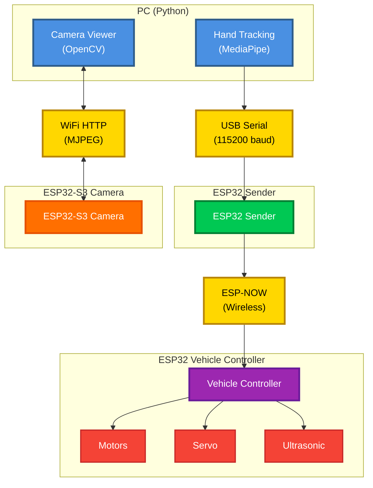

# Gesture-Controlled Car Project

A hands-on robotics project that lets you control a mecanum-wheeled car using hand gestures! The system uses a webcam to track your hand movements, sends commands wirelessly to an ESP32-controlled vehicle, and streams live video from an onboard camera.

## What This Project Does

In simple terms: **You wave your hand in front of a webcam, and the car moves accordingly!**

- 👋 **Hand Tracking**: Your PC uses a webcam and MediaPipe to recognize hand gestures
- 📡 **Wireless Control**: Commands are sent via ESP-NOW (a fast wireless protocol) to the car
- 🚗 **Vehicle Control**: An ESP32 on the car receives commands and controls 4 motors for mecanum wheel movement
- 📹 **Live Video**: An ESP32-S3 camera module streams video back to your PC over WiFi

## System Architecture



### Communication Flow

1. **PC → ESP32 Sender**: USB Serial (115200 baud)
2. **ESP32 Sender → Vehicle**: ESP-NOW (2.4GHz wireless)
3. **ESP32-S3 Camera → PC**: WiFi HTTP (MJPEG stream on port 80)

## Hardware Requirements

### PC Side
- **Computer**: Windows, Linux, or macOS
- **Webcam**: USB webcam (built-in or external)
- **USB Port**: For connecting ESP32 sender
- **Python**: Version 3.7+ (3.10 recommended)
- **WiFi**: For camera stream (same network as ESP32-S3)

### ESP32 Components

#### ESP32 Sender
- ESP32 development board (e.g., ESP32 DevKit)
- USB cable for PC connection

#### ESP32 Vehicle Controller
- ESP32 development board
- **Motors**: 4x DC motors with mecanum wheels
- **Motor Drivers**: 2x L298N motor driver modules
- **Power Supply**: Adequate for motors (e.g., 7.4V battery pack)
- **Servo Motor**: For obstacle scanning (optional)
- **Ultrasonic Sensor**: HC-SR04 for obstacle detection
- **Wiring**: Jumper wires, breadboard/protoboard

#### ESP32-S3 Camera Module
- ESP32-S3 development board (with camera support)
- OV2640 camera module
- WiFi access (for video streaming)

### Pin Connections

See component-specific documentation for detailed pin assignments:
- [Vehicle Controller Pins](Vehicule/README.md#hardware-connections)
- [Camera Module Pins](ESP_Camera_Module/README.md#hardware-setup)

## Software Dependencies

### Python Packages
Install Python dependencies for hand tracking:
```bash
pip install -r requirements.txt
```

Required packages:
- `opencv-python>=4.5.0` - Computer vision
- `numpy>=1.19.0` - Numerical computing (used by camera viewer)
- `mediapipe==0.10.9` - Hand tracking
- `pyserial>=3.5` - Serial communication

### PlatformIO
Install PlatformIO for ESP32 development:
```bash
pip install platformio
```

PlatformIO is used to build and upload code to:
- ESP32 Vehicle Controller
- ESP32-S3 Camera Module

### Arduino IDE (Alternative)
The ESP32 sender code can be uploaded using Arduino IDE if preferred.

## Quick Start Guide

### Step 1: Install Dependencies

**Python packages:**
```bash
python -m venv venv  # Optional: create virtual environment (can be in Hand_Tracking/ or project root)
source venv/bin/activate  # Linux/Mac, or `venv\Scripts\activate` on Windows
pip install -r requirements.txt  # Install from project root
```

**PlatformIO:**
```bash
pip install platformio
```

### Step 2: Configure ESP32 Sender

1. Connect ESP32 sender to PC via USB
2. Find the COM port:
   - **Linux**: `/dev/ttyUSB0` or `/dev/ttyACM0`
   - **Windows**: `COM3`, `COM11`, etc. (check Device Manager)
   - **macOS**: `/dev/cu.usbserial-*`
3. Upload sender code (see [Sender Documentation](Transmission/Sender_Code/README.md))

### Step 3: Build and Upload Vehicle Controller

```bash
cd Vehicule
# Edit platformio.ini to set your upload port
pio run -t upload
```

**Important**: Note the MAC address printed in Serial Monitor - you'll need it for the sender!

### Step 4: Build and Upload Camera Module

```bash
cd ESP_Camera_Module
# Edit src/main.cpp to set WiFi SSID and password
# Edit platformio.ini to set your upload port
pio run -t upload
```

**Important**: Note the IP address printed in Serial Monitor!

### Step 5: Configure Hand Tracking

Edit `Hand_Tracking/constant.py`:
```python
COM_PORT = '/dev/ttyACM0'  # Your ESP32 sender port
BAUD_RATE = 115200
```

### Step 6: Configure Sender MAC Address

Edit `Transmission/Sender_Code/Sender_Code.ino`:
```cpp
uint8_t receiverMAC[] = {0xXX, 0xXX, 0xXX, 0xXX, 0xXX, 0xXX};  // Vehicle MAC
```

### Step 7: Run the System

**Option 1: Use the run script**
```bash
./run.sh --ip 192.168.1.100  # Replace with your camera IP
```

**Option 2: Manual launch**
```bash
# Terminal 1: Start hand tracking
cd Hand_Tracking
python Hand_Tracker.py

# Terminal 2: View camera stream
cd ESP_Camera_Module/src
python camera_viewer.py --ip 192.168.1.100
```

## Building and Uploading

### Vehicle Controller

```bash
cd Vehicule

# Build only
pio run

# Build and upload
pio run -t upload

# Monitor serial output
pio device monitor
```

**Configuration**: Edit `src/config.h` for pin assignments and motor speeds.

### Camera Module

```bash
cd ESP_Camera_Module

# Build and upload
pio run -t upload

# Monitor serial output (to see IP address)
pio device monitor
```

**Configuration**: Edit `src/main.cpp` for WiFi credentials.

### Sender

**Using PlatformIO** (if you create a platformio.ini):
```bash
cd Transmission/Sender_Code
pio run -t upload
```

**Using Arduino IDE**:
1. Open `Sender_Code.ino` in Arduino IDE
2. Select ESP32 board
3. Set COM port
4. Click Upload

## Running the System

### Launch Sequence

1. **Power on the vehicle** (ESP32 controller + motors)
2. **Connect ESP32 sender** to PC via USB
3. **Power on ESP32-S3 camera** (wait for WiFi connection)
4. **Start hand tracking**:
   ```bash
   cd Hand_Tracking
   python Hand_Tracker.py
   ```
5. **View camera stream** (optional):
   ```bash
   cd ESP_Camera_Module/src
   python camera_viewer.py --ip <CAMERA_IP>
   ```

### Gesture Commands

| Gesture | Command | Vehicle Action |
|---------|---------|----------------|
| 👊 Closed fist | `Stop` | All motors stop |
| 👆 Index finger up | `Forward` | Move forward |
| 👇 Index finger down | `Backward` | Move backward |
| ✋ Open hand (center) | `Center` | Stop (neutral) |
| 🔄 Circle (right) | `rotate_cw` | Rotate clockwise |
| 🔄 Circle (left) | `rotate_ccw` | Rotate counter-clockwise |
| Hand position | `Sideway_Left/Right` | Strafe left/right |
| Hand position | `diagonal_*` | Diagonal movements |

## Component Documentation

For detailed information on each component:

- **[Vehicle Controller](Vehicule/README.md)** - ESP32 vehicle control system
  - [Technical Details](docs/VEHICLE_CONTROLLER.md) - Architecture, FreeRTOS, protocols
- **[Hand Tracking](Hand_Tracking/README.md)** - PC-side gesture recognition
- **[Camera Module](ESP_Camera_Module/README.md)** - ESP32-S3 video streaming
- **[ESP32 Sender](Transmission/Sender_Code/README.md)** - Wireless command bridge
- **[PC Side Components](docs/PC_SIDE_COMPONENTS.md)** - Technical overview

## Troubleshooting

### Hand Tracking Issues

**Problem**: No serial connection
- **Solution**: Check `COM_PORT` in `Hand_Tracking/constant.py` matches your ESP32 sender port
- **Check**: ESP32 sender is connected and Serial Monitor shows "🟢 Sender ready"

**Problem**: Gesture not recognized
- **Solution**: Ensure good lighting and clear hand visibility
- **Check**: Webcam is working (test with other applications)

**Problem**: Commands not sending
- **Solution**: Verify ESP32 sender Serial Monitor shows commands being received
- **Check**: Serial connection is stable (try reconnecting USB)

### ESP-NOW Communication Issues

**Problem**: Commands not received by vehicle
- **Solution**: Verify MAC addresses match between sender and receiver
- **Check**: Both ESP32s are powered on and in WiFi STA mode
- **Check**: Vehicle Serial Monitor shows received commands

**Problem**: Connection fails
- **Solution**: Ensure both ESP32s are on the same WiFi channel (default: 0)
- **Check**: No interference from other 2.4GHz devices

### Camera Stream Issues

**Problem**: Cannot connect to camera stream
- **Solution**: Verify ESP32-S3 IP address from Serial Monitor
- **Check**: PC and ESP32-S3 are on the same WiFi network
- **Test**: Open `http://<ESP32_IP>/stream` in browser

**Problem**: Stream is slow or laggy
- **Solution**: Check WiFi signal strength
- **Check**: Reduce camera resolution in code if needed

### Vehicle Control Issues

**Problem**: Motors don't move
- **Solution**: Check pin connections in `Vehicule/src/config.h`
- **Check**: Motor driver power supply is adequate
- **Check**: Common PWM pin (pin 2) is connected correctly

**Problem**: Wrong movement direction
- **Solution**: Swap IN1/IN2 pins in motor configuration
- **Check**: Motor wiring matches pin assignments

**Problem**: Emergency stop always active
- **Solution**: Check ultrasonic sensor distance (should be > 10cm normally)
- **Check**: `EMERGENCY_STOP_DISTANCE_CM` in `config.h`

## Project Structure

```
final-project-gesture-car/
├── README.md                    # This file
├── requirements.txt            # Python dependencies (project root)
├── Hand_Tracking/              # PC-side hand gesture recognition
│   ├── Hand_Tracker.py         # Main tracking script
│   └── constant.py             # Serial port configuration
├── Vehicule/                   # ESP32 vehicle controller
│   ├── src/                    # Source code
│   ├── platformio.ini         # Build configuration
│   └── README.md              # Vehicle documentation
├── ESP_Camera_Module/          # ESP32-S3 camera streaming
│   ├── src/
│   │   ├── main.cpp           # Camera firmware
│   │   └── camera_viewer.py   # PC viewer
│   └── README.md              # Camera documentation
├── Transmission/               # Communication modules
│   └── Sender_Code/           # ESP32 sender
│       └── README.md          # Sender documentation
└── docs/                       # Technical documentation
    ├── VEHICLE_CONTROLLER.md  # Vehicle technical details
    └── PC_SIDE_COMPONENTS.md  # PC components technical details
```

## License

No license is included in this repository. Add an appropriate `LICENSE` file if you want to publish or share this project under a specific license.

## Contributing

This is a learning project. Feel free to fork, modify, and improve!

## Support

For issues and questions:
1. Check the troubleshooting section above
2. Review component-specific documentation
3. Check Serial Monitor output for error messages
4. Verify hardware connections match documentation

---

**Happy Gesturing! 🚗👋**
