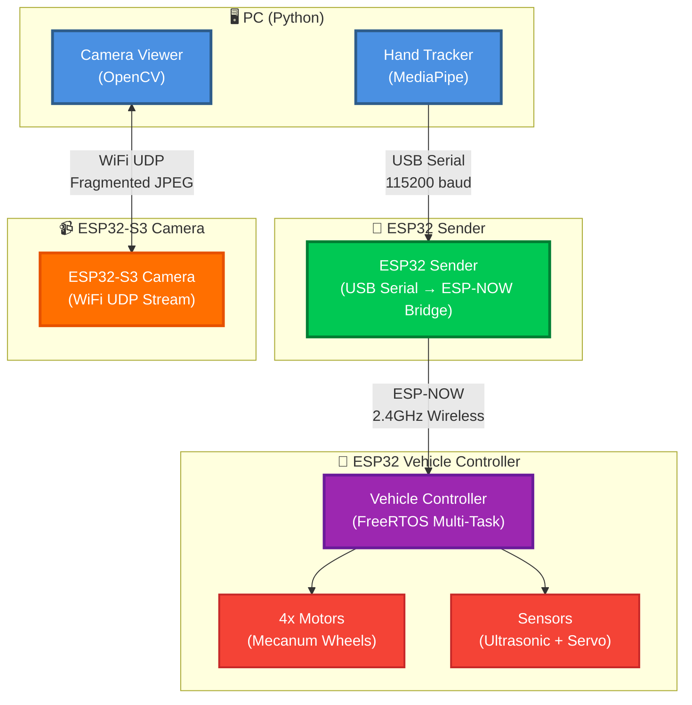
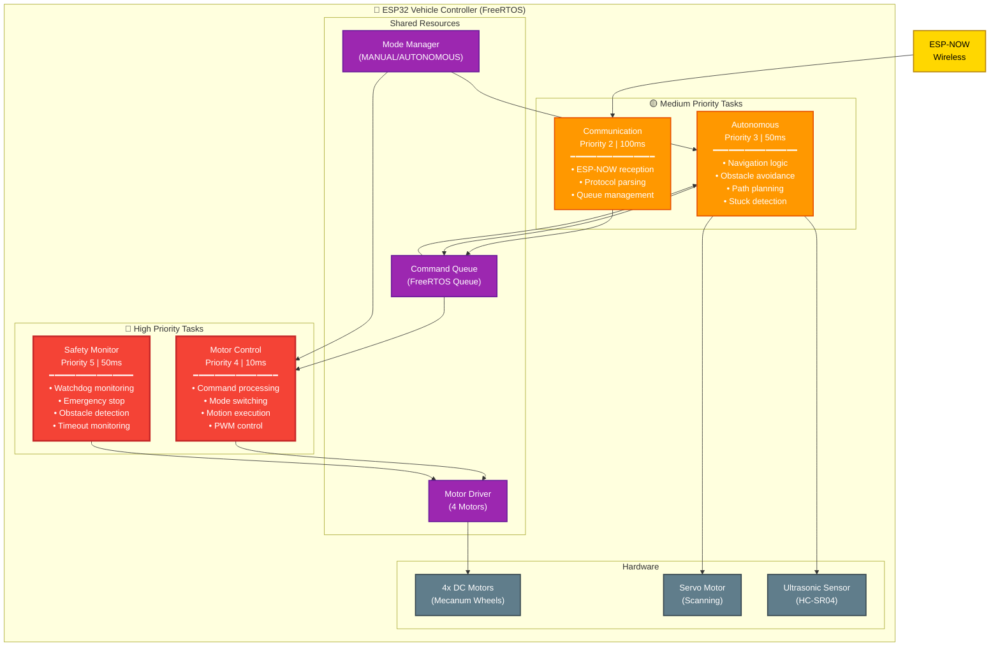
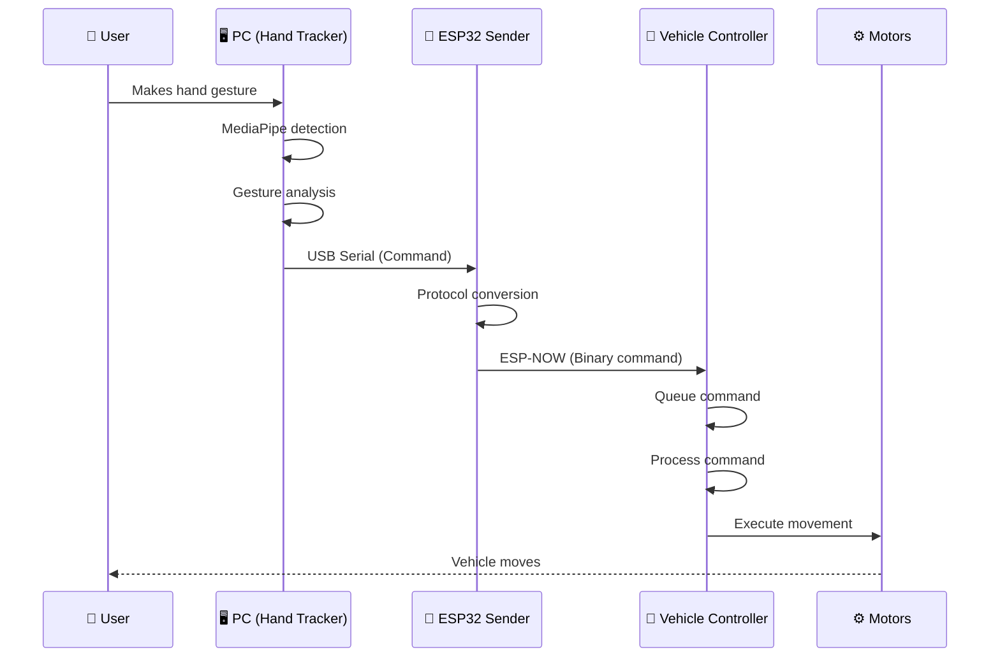
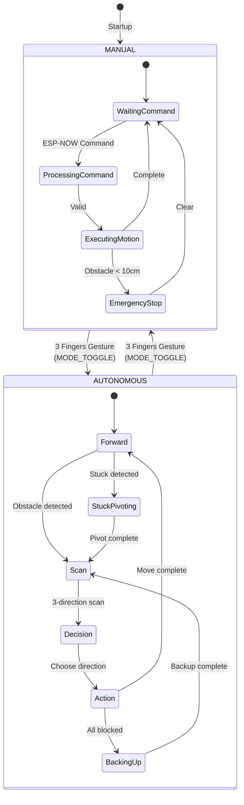

# Gesture-Controlled Car Project

A hands-on robotics project that lets you control a mecanum-wheeled car using hand gestures! The system uses a webcam to track your hand movements, sends commands wirelessly to an ESP32-controlled vehicle, and streams live video from an onboard camera.

## 🚀 Quick Start

```bash
# Install dependencies
pip install -r requirements.txt

# Start the system (hand tracking + camera stream)
./launch.sh
```

Or manually:
```bash
# Terminal 1: Hand tracking
cd pc_side/Hand_Tracking && python Hand_Tracker.py

# Terminal 2: Camera stream
cd pc_side/ESP_Camera_Module && ./start_stream.sh
```

## 📋 Key Features

- **👋 Hand Gesture Control**: Control the car with natural hand movements using MediaPipe
- **🚗 Mecanum Wheel Drive**: Full omnidirectional movement (forward, backward, strafe, rotate, diagonal)
- **🤖 Autonomous Mode**: Obstacle avoidance with ultrasonic sensor and servo scanning
- **📹 Live Video Streaming**: Real-time video feed from ESP32-S3 camera module
- **⚡ Real-Time Control**: FreeRTOS-based vehicle controller with < 20ms latency
- **🔒 Safety Systems**: Watchdog, emergency stop, timeout monitoring
- **📡 Wireless Communication**: ESP-NOW protocol for low-latency command transmission

## 📚 Component Documentation

For detailed information on each component:

- **[Vehicle Controller](Vehicule/README.md)** - ESP32 vehicle control system
  - [Technical Details](docs/VEHICLE_CONTROLLER.md) - Architecture, FreeRTOS, protocols
- **[Hand Tracking](pc_side/Hand_Tracking/README.md)** - PC-side gesture recognition
- **[Camera Module](pc_side/ESP_Camera_Module/README.md)** - ESP32-S3 video streaming
- **[ESP32 Sender](pc_side/Sender_Code/README.md)** - Wireless command bridge
- **[Architecture Documentation](docs/architecture.md)** - Complete system architecture


## 🏗️ System Architecture

### High-Level Overview



### Vehicle Controller Architecture (FreeRTOS)



### Communication Flow



### Operating Modes



## 🔧 Hardware Setup

### PC Requirements

- **Computer**: Windows, Linux, or macOS
- **Webcam**: USB webcam (built-in or external)
- **USB Port**: For ESP32 sender connection
- **Python**: Version 3.7+ (3.10 recommended)
- **WiFi**: For camera stream (same network as ESP32-S3)

### ESP32 Components

#### 1. ESP32 Sender (Command Bridge)
- **Board**: ESP32 development board (e.g., ESP32 DevKit)
- **Connection**: USB cable to PC
- **Function**: Bridges USB Serial to ESP-NOW wireless

#### 2. ESP32 Vehicle Controller
- **Board**: ESP32 development board
- **Motors**: 4x DC motors with mecanum wheels
- **Motor Drivers**: 2x TB6612 motor driver modules
- **Power Supply**: 7.4V battery pack (for motors)
- **Servo Motor**: SG90 or similar (for obstacle scanning)
- **Ultrasonic Sensor**: HC-SR04

#### 3. ESP32-S3 Camera Module
- **Board**: ESP32-S3 development board with camera support
- **Camera**: OV2640 camera module
- **Connection**: WiFi (2.4GHz network)

### Power Supply

- **ESP32 Controllers**: USB power or external 5V supply
- **Motors**: Separate 7.4V battery pack connected to TB6612 drivers
- **Common Ground**: All grounds must be connected together

## 📦 Software Installation

### Python Dependencies

```bash
pip install -r requirements.txt
```

**Required packages:**
- `opencv-python>=4.5.0` - Computer vision
- `numpy>=1.19.0` - Numerical computing
- `mediapipe==0.10.9` - Hand tracking
- `pyserial>=3.5` - Serial communication

### PlatformIO (for ESP32)

```bash
pip install platformio
```

PlatformIO is used to build and upload code to:
- ESP32 Vehicle Controller
- ESP32-S3 Camera Module

## ⚙️ Configuration

### 1. Configure ESP32 Sender

1. Connect ESP32 sender to PC via USB
2. Find the COM port:
3. Upload sender code (see [Sender Documentation](pc_side/Sender_Code/README.md))

### 2. Build and Upload Vehicle Controller

```bash
cd Vehicule
pio run -t upload
```

**Important**: Note the MAC address printed in Serial Monitor - you'll need it for the sender!

### 3. Configure Sender MAC Address

Edit `pc_side/Sender_Code/Sender_Code.ino`:
```cpp
uint8_t receiverMAC[] = {0xXX, 0xXX, 0xXX, 0xXX, 0xXX, 0xXX}; 
```

### 4. Build and Upload Camera Module

```bash
cd pc_side/ESP_Camera_Module
pio run -t upload
```

**Important**: Note the IP address printed in Serial Monitor!

### 5. Configure Hand Tracking

Edit `pc_side/Hand_Tracking/constant.py`:
```python
COM_PORT = '/dev/ttyACM0'
```

## 🎮 Gesture Commands

| Gesture | Command | Vehicle Action |
|---------|---------|----------------|
| 👊 Closed fist (all 4 fingers bent) | `STOP` | All motors stop |
| ✋ Open hand | Position-based | Car moves in the direction where you position your hand in space |
| 👆 1 finger raised | `ROTATE_CW` | Rotate clockwise |
| ✌️ 2 fingers raised | `ROTATE_CCW` | Rotate counter-clockwise |
| 🖐️ 3 fingers raised (hold ~0.5s) | `MODE_TOGGLE` | Switch MANUAL/AUTONOMOUS mode |

**Note**: Gesture detection is based on:
- **Open hand**: Position your hand in space relative to screen center - the car moves in that direction (forward, backward, sideway, diagonal)
- **Finger state**: Number of raised fingers (excluding thumb) determines rotation commands
- **Stability filter**: Gesture must be stable for 3 frames (2 frames for STOP) before sending
- **Mode toggle**: Requires 3 fingers held for ~15 frames (~0.5 seconds) with 1 second cooldown

## 🏃 Running the System

### Quick Start

```bash
# Launch both hand tracking and camera stream
./launch.sh
```

The camera viewer will automatically discover the ESP32-S3 camera via UDP broadcast (port 5001) and receive the video stream on port 5000.

## 📊 Key Technical Points

### Performance Metrics

- **Command Latency**: < 20ms (PC → Motors)
- **Motor Control Frequency**: 100Hz (10ms period)
- **Sensor Update Rate**: 20Hz (50ms period)
- **Autonomous Navigation**: 20Hz (50ms period)
- **Communication Protocol**: Binary (1 byte/command)
- **Video Streaming**: Fragmented JPEG over UDP (WiFi, port 5000)

### Architecture Highlights

- **FreeRTOS Multi-Tasking**: 4 concurrent tasks with priority-based scheduling
- **Safety-First Design**: Watchdog, emergency stop, timeout monitoring
- **Modular Code Structure**: Separate drivers, control, communication, and safety layers
- **Binary Protocol**: Efficient single-byte commands over ESP-NOW
- **Dual Operating Modes**: Manual gesture control and autonomous navigation
- **Real-Time Control**: Guaranteed response times with FreeRTOS priorities

## 📁 Project Structure

```
final-project-gesture-car/
├── README.md                    # This file
├── requirements.txt            # Python dependencies
├── launch.sh                   # Quick start script
├── run.sh                      # Alternative launch script
│
├── pc_side/                    # PC-side components
│   ├── Hand_Tracking/          # Hand gesture recognition
│   │   ├── Hand_Tracker.py     # Main tracking script
│   │   └── constant.py         # Serial port configuration
│   ├── ESP_Camera_Module/      # ESP32-S3 camera streaming
│   │   ├── src/
│   │   │   ├── main.cpp        # Camera firmware
│   │   │   └── camera_viewer.py # PC viewer
│   │   └── README.md           # Camera documentation
│   └── Sender_Code/            # ESP32 sender
│       └── README.md           # Sender documentation
│
├── Vehicule/                   # ESP32 vehicle controller
│   ├── src/
│   │   ├── main.cpp            # Entry point, FreeRTOS init
│   │   ├── config.h            # Pin definitions, constants
│   │   ├── drivers/            # Hardware drivers
│   │   ├── communication/     # ESP-NOW, protocols
│   │   ├── control/            # Motion control, mode manager
│   │   ├── safety/             # Watchdog, timeout, emergency stop
│   │   ├── tasks/              # FreeRTOS tasks
│   │   └── shared/             # Queues, types
│   ├── platformio.ini         # Build configuration
│   └── README.md              # Vehicle documentation
│
└── docs/                       # Technical documentation
    ├── architecture.md         # Detailed architecture
    ├── VEHICLE_CONTROLLER.md  # Vehicle technical details
    └── PC_SIDE_COMPONENTS.md  # PC components technical details
```

## 🛠️ Development

### Building Vehicle Controller

```bash
cd Vehicule
pio run              # Build only
pio run -t upload    # Build and upload
pio device monitor   # Monitor serial output
```

### Building Camera Module

```bash
cd pc_side/ESP_Camera_Module
pio run -t upload
pio device monitor   # To see IP address
```

**Happy Gesturing! 🚗👋**
