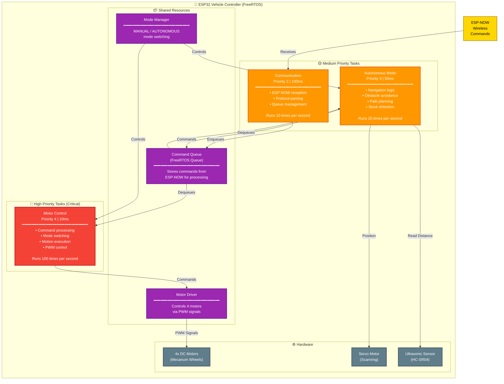
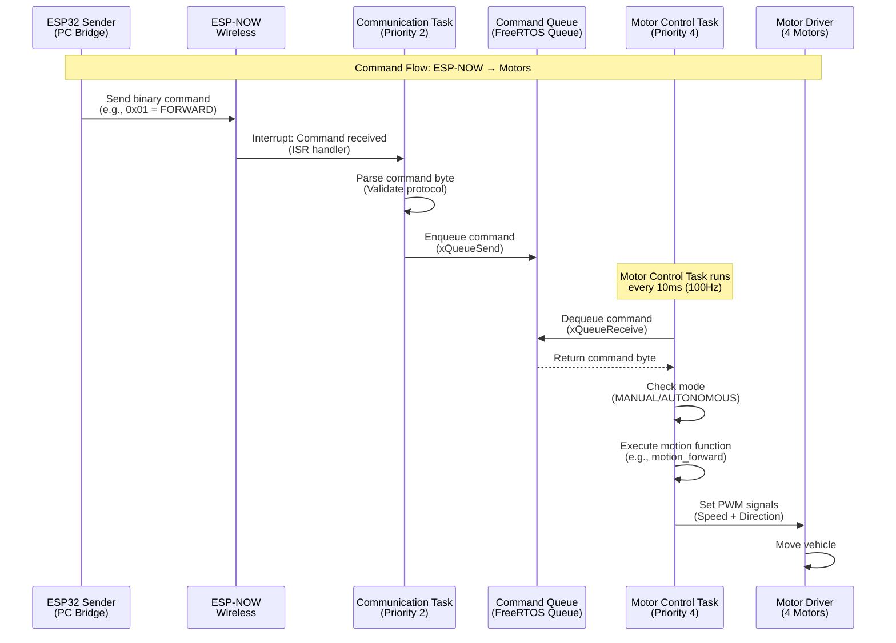
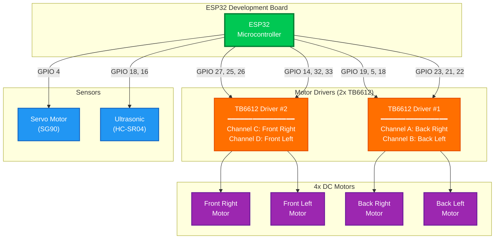
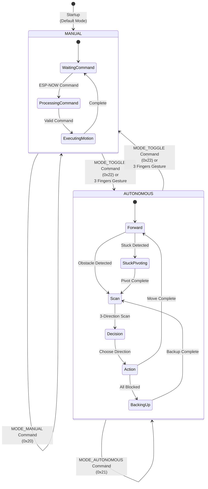

# ESP32 Vehicle Controller

Advanced FreeRTOS-based control system for gesture-controlled mecanum wheel robot. This ESP32-based controller receives wireless commands via ESP-NOW and controls 4 motors, a servo motor, and an ultrasonic sensor for autonomous navigation.


## 📋 Key Features

- **🔄 FreeRTOS Multi-Tasking**: 4 concurrent tasks with priority-based scheduling
- **🛡️ Safety Systems**: Watchdog timer, emergency stop, timeout monitoring
- **🚗 Mecanum Drive**: Full omnidirectional movement (forward, backward, strafe, rotate, diagonal)
- **🤖 Autonomous Mode**: Obstacle avoidance with ultrasonic sensor and servo scanning
- **📡 ESP-NOW Communication**: Low-latency wireless command reception (< 20ms)
- **⚡ Real-Time Control**: 100Hz motor control (10ms period) for smooth operation

## 🏗️ Architecture Overview

### What is FreeRTOS?

**FreeRTOS** (Free Real-Time Operating System) allows the ESP32 to run multiple tasks at the same time. Each task is a separate function that runs independently.

**How it works**:
- Each task has a priority level (0 to 25, where higher numbers mean more important)
- The system checks which task should run thousands of times per second
- If a high-priority task needs to run, it can interrupt a lower-priority task immediately
- Tasks of the same priority take turns running
- Each task can pause itself to let other tasks run

**In this system**:
- **Motor Control (Priority 4)**: Runs every 10ms to update motor speeds. This ensures smooth movement.
- **Autonomous (Priority 3)**: Runs every 50ms when in autonomous mode to plan navigation and avoid obstacles.
- **Communication (Priority 2)**: Runs every 100ms to check for new commands from the ESP32 sender.

The system switches between tasks so quickly that they appear to run simultaneously, but the ESP32 actually runs them one at a time, switching very rapidly between them.

### FreeRTOS Task Architecture



### Command Processing Flow



### Hardware Connection Diagram



## 🎮 Operating Modes

The vehicle controller supports two operating modes: **Manual Mode** and **Autonomous Mode**. You can switch between them using gesture commands or mode control commands.

### Manual Mode

**Default Mode**: The vehicle starts in Manual Mode.

**How it works**:
- Vehicle responds directly to commands received via ESP-NOW
- Commands come from the PC hand tracker through the ESP32 sender
- Each gesture translates to a movement command (forward, backward, strafe, rotate, etc.)
- Vehicle executes commands immediately as they are received
- No obstacle avoidance - user has full control

**Use cases**:
- Precise control for specific movements
- Testing and debugging
- Manual navigation in controlled environments

**Switching to Manual Mode**:
- Send `MODE_MANUAL` command (0x20) via ESP-NOW
- Or use gesture: 3 fingers held for ~0.5 seconds (mode toggle)

### Autonomous Mode

**How it works**:
- Vehicle navigates independently using sensors
- Autonomous task runs every 50ms to plan navigation
- Uses ultrasonic sensor and servo motor to scan for obstacles
- Automatically avoids obstacles and navigates around them
- Makes decisions based on 3-direction scanning (left, center, right)
- Can detect when stuck and perform recovery maneuvers

**Features**:
- **Obstacle Detection**: Scans environment using servo-mounted ultrasonic sensor
- **Path Planning**: Chooses best direction based on scan results
- **Stuck Detection**: Detects when vehicle cannot move and performs recovery
- **Continuous Scanning**: Periodically rescans environment while moving forward

**Use cases**:
- Hands-free operation
- Exploration of unknown environments
- Obstacle avoidance demonstrations

**Switching to Autonomous Mode**:
- Send `MODE_AUTONOMOUS` command (0x21) via ESP-NOW
- Or use gesture: 3 fingers held for ~0.5 seconds (mode toggle)

### Mode Switching



### Mode Control Commands

| Command | Byte | Description |
|---------|------|-------------|
| MODE_MANUAL | 0x20 | Switch to manual mode |
| MODE_AUTONOMOUS | 0x21 | Switch to autonomous mode |
| MODE_TOGGLE | 0x22 | Toggle between manual and autonomous |

**Note**: When switching modes, the vehicle automatically stops all motors to ensure safe transitions.

### Mode Behavior Comparison

| Feature | Manual Mode | Autonomous Mode |
|---------|-------------|-----------------|
| **Command Source** | ESP-NOW (from PC) | Autonomous task (internal) |
| **Control** | User via gestures | Automatic navigation |
| **Obstacle Avoidance** | None | Active (ultrasonic + servo) |
| **Sensor Usage** | Not used | Ultrasonic sensor + servo scanning |
| **Task Activity** | Motor Control + Communication | Motor Control + Communication + Autonomous |
| **Use Case** | Precise control | Hands-free navigation |

## ⚙️ Configuration

### Pin Assignments

All pin definitions are in `src/config.h`. Key constants:

```cpp
// Front Right Motor
#define FRONT_RIGHT_EN     27  // PWM pin
#define FRONT_RIGHT_IN1     25  // Direction pin 1
#define FRONT_RIGHT_IN2     26  // Direction pin 2

// Sensors
#define SERVO_PIN           4   // Servo motor
#define ULTRASONIC_TRIG     12  // Ultrasonic trigger
#define ULTRASONIC_ECHO     16  // Ultrasonic echo
```

### Motor Speed Settings

Adjust motor speeds in `src/config.h`:

```cpp
#define MOTOR_SPEED_SLOW   150  // Slow speed (0-255)
#define MOTOR_SPEED_FAST   255  // Fast speed (0-255)
```

**Speed Range**: 0-255 (0 = stopped, 255 = maximum speed)

### Safety Thresholds

Configure safety parameters:

```cpp
#define EMERGENCY_STOP_DISTANCE_CM 10    // Stop if obstacle < 10cm
#define COMMAND_TIMEOUT_MS         500   // Auto-stop if no command received
#define WATCHDOG_TIMEOUT_MS        5000  // 5 second watchdog
```

### FreeRTOS Task Configuration

Task priorities and periods (in `src/config.h`):

```cpp
// Task Priorities (higher number = higher priority)
#define TASK_PRIORITY_MOTOR_CONTROL     4  // High - real-time control
#define TASK_PRIORITY_AUTONOMOUS        3  // Medium - navigation
#define TASK_PRIORITY_COMMUNICATION     2  // Medium - command handling

// Task Periods (milliseconds) - how often task runs
#define TASK_PERIOD_MOTOR_CONTROL      10   // 100 Hz (10ms)
#define TASK_PERIOD_AUTONOMOUS         50   // 20 Hz (50ms)
#define TASK_PERIOD_COMMUNICATION     100   // 10 Hz (100ms)
```

**Understanding Task Priorities**:
- **Priority 4 (Motor)**: Highest priority - runs frequently (100Hz) for smooth control
- **Priority 3 (Autonomous)**: Medium priority - runs when in autonomous mode
- **Priority 2 (Communication)**: Medium priority - runs when commands arrive


## 💡 Tips for Junior Developers

### Understanding FreeRTOS

**Think of FreeRTOS like a restaurant**:
- **Tasks** = Workers (each has a specific job)
- **Priority** = Importance (higher priority workers get attention first)
- **Queue** = Order board (tasks communicate via queues)
- **Scheduler** = Manager (decides which worker does what, when)

### Common Concepts

- **PWM (Pulse Width Modulation)**: A way to control motor speed by rapidly turning power on/off
- **ESP-NOW**: A fast wireless protocol for ESP32 devices (like Bluetooth but faster and simpler)
- **Queue**: A data structure where tasks can put messages for other tasks to read
- **Interrupt**: An event that immediately pauses current work to handle something urgent

### Debugging Tips

1. **Always check Serial Monitor first** - it shows what's happening
2. **Start simple** - test one motor, then one task, then combine
3. **Check connections** - most issues are wiring problems
4. **Use print statements** - Add `Serial.println()` to see code execution flow
5. **Monitor free heap** - Low memory can cause crashes

### Reading the Code

1. **Start with `main.cpp`** - This is where everything begins
2. **Look at `config.h`** - All settings are here
3. **Check task files** - Each task is in `tasks/task_*.cpp`
4. **Read driver files** - These control the hardware directly

## 📚 Related Documentation

- **[Main Project README](../README.md)** - Complete system overview
- **[PC-Side Components](../pc_side/README.md)** - PC-side components documentation
- **[Vehicle Controller Technical Details](../docs/VEHICLE_CONTROLLER.md)** - Deep technical reference
- **[Architecture Documentation](../docs/architecture.md)** - System architecture details

