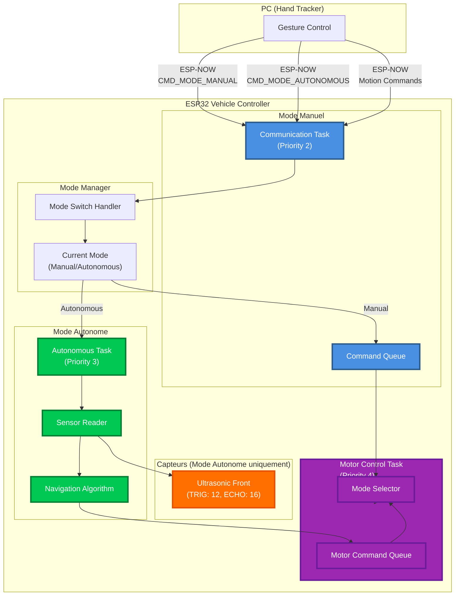

# Architecture Mode Autonome - Gesture Car

**Version:** 1.1 (Simplifiée)  
**Date:** 2025-01-27  
**Auteur:** Winston (Architect)

---

## Vue d'Ensemble

Le système de voiture contrôlée par gestes va être étendu avec un **mode de conduite autonome** qui utilise un capteur ultrasonique avant pour naviguer et éviter les obstacles, en complément du mode manuel existant.

### Objectifs

- **Mode Manuel:** Conservé tel quel (commandes ESP-NOW depuis PC)
- **Mode Autonome:** Navigation automatique avec évitement d'obstacles (version simplifiée)
- **Basculement:** Changement de mode via commande ESP-NOW
- **Capteurs:** Capteur ultrasonique avant uniquement (utilisé en mode autonome)
- **Version 1.0:** Pas de MPU, pas de capteur arrière (simplification pour première version)

---

## Architecture du Système

### Diagramme d'Architecture



---

## Composants à Implémenter

### 1. Gestionnaire de Mode

**Fichier:** `src/control/mode_manager.h/cpp`

**Responsabilités:**
- Gérer l'état actuel du mode (Manual/Autonomous)
- Permettre le basculement entre modes
- Protéger contre les changements de mode pendant l'exécution

**Interface:**
```cpp
enum DrivingMode {
    MODE_MANUAL = 0,
    MODE_AUTONOMOUS = 1
};

class ModeManager {
public:
    static ModeManager& getInstance();
    
    DrivingMode getCurrentMode() const;
    bool setMode(DrivingMode mode);
    bool isManualMode() const;
    bool isAutonomousMode() const;
    
private:
    DrivingMode current_mode_;
    mutable SemaphoreHandle_t mode_mutex_;
};
```

### 2. Commandes de Mode

**Fichier:** `src/communication/command_protocol.h`

**Nouvelles commandes:**
```cpp
enum CommandByte {
    // ... commandes existantes (0x00-0x0C) ...
    
    // Mode control commands
    CMD_MODE_MANUAL = 0x20,        // Basculer en mode manuel
    CMD_MODE_AUTONOMOUS = 0x21,    // Basculer en mode autonome
    CMD_MODE_TOGGLE = 0x22,        // Basculer entre modes
    
    // ... autres commandes ...
};
```

### 3. Configuration Hardware

**Fichier:** `src/config.h`

**Ajouts nécessaires:**
```cpp
// Ultrasonic Sensor - Front (seul capteur pour version 1.0)
#define ULTRASONIC_FRONT_TRIG    12
#define ULTRASONIC_FRONT_ECHO    16

// Mode autonome settings
#define AUTONOMOUS_TASK_PRIORITY     3
#define AUTONOMOUS_TASK_PERIOD_MS    50   // 20 Hz
#define AUTONOMOUS_TASK_STACK_SIZE   4096

// Navigation parameters
#define OBSTACLE_DISTANCE_THRESHOLD_CM  20  // Distance minimale avant obstacle
#define SAFE_DISTANCE_CM                30  // Distance de sécurité
#define TURN_SPEED                      150 // Vitesse de rotation
#define FORWARD_SPEED                   200 // Vitesse avant
#define BACKWARD_SPEED                  180 // Vitesse arrière
```

### 4. Driver Capteur Ultrasonique (Réutilisé)

**Fichier:** `src/drivers/ultrasonic_driver.h/cpp`

**Note:** Le driver existant est réutilisé tel quel, une seule instance nécessaire:
```cpp
// Dans task_autonomous.cpp
static Ultrasonic ultrasonic_front;
```

### 5. ~~Driver MPU (IMU)~~ - Non utilisé en version 1.0

**Note:** Le MPU n'est pas utilisé dans la version 1.0. Pour les versions futures, un driver MPU pourra être ajouté pour améliorer la navigation avec orientation.

### 6. Tâche Autonome

**Fichier:** `src/tasks/task_autonomous.cpp`

**Algorithme de navigation simple:**

```cpp
void task_autonomous(void *pvParameters) {
    // Initialisation - Version simplifiée (1 capteur avant seulement)
    Ultrasonic front_sensor;
    front_sensor.init(ULTRASONIC_FRONT_TRIG, ULTRASONIC_FRONT_ECHO);
    
    ModeManager& mode_mgr = ModeManager::getInstance();
    
    // État de navigation
    enum NavigationState {
        STATE_FORWARD,
        STATE_BACKWARD,
        STATE_TURN_LEFT,
        STATE_TURN_RIGHT,
        STATE_STOP
    };
    NavigationState state = STATE_FORWARD;
    
    // Compteur pour gérer les transitions
    uint32_t turn_duration_ms = 0;
    const uint32_t TURN_DURATION_MS = 1000;  // Durée de rotation (1 seconde)
    
    const TickType_t period = pdMS_TO_TICKS(AUTONOMOUS_TASK_PERIOD_MS);
    TickType_t lastWakeTime = xTaskGetTickCount();
    
    while (1) {
        // Vérifier que nous sommes en mode autonome
        if (!mode_mgr.isAutonomousMode()) {
            vTaskDelay(period);
            continue;
        }
        
        // Lire le capteur avant
        float front_distance = front_sensor.readDistanceCM();
        
        // Algorithme de navigation simplifié
        uint8_t command = CMD_STOP;
        
        if (front_distance > 0 && front_distance < OBSTACLE_DISTANCE_THRESHOLD_CM) {
            // Obstacle détecté devant
            if (state == STATE_FORWARD) {
                // Arrêter, puis tourner
                command = CMD_STOP;
                state = STATE_TURN_RIGHT;
                turn_duration_ms = 0;
            } else if (state == STATE_TURN_RIGHT || state == STATE_TURN_LEFT) {
                // En train de tourner
                turn_duration_ms += AUTONOMOUS_TASK_PERIOD_MS;
                if (turn_duration_ms < TURN_DURATION_MS) {
                    // Continuer à tourner
                    command = (state == STATE_TURN_RIGHT) ? CMD_ROTATE_CW : CMD_ROTATE_CCW;
                } else {
                    // Rotation terminée, vérifier à nouveau
                    // Si toujours obstacle, tourner de l'autre côté
                    float new_distance = front_sensor.readDistanceCM();
                    if (new_distance > 0 && new_distance < OBSTACLE_DISTANCE_THRESHOLD_CM) {
                        // Toujours un obstacle, tourner de l'autre côté
                        state = (state == STATE_TURN_RIGHT) ? STATE_TURN_LEFT : STATE_TURN_RIGHT;
                        command = (state == STATE_TURN_RIGHT) ? CMD_ROTATE_CW : CMD_ROTATE_CCW;
                        turn_duration_ms = 0;
                    } else {
                        // Obstacle évité, avancer
                        state = STATE_FORWARD;
                        command = CMD_FORWARD;
                    }
                }
            }
        } else {
            // Pas d'obstacle détecté - avancer
            if (state != STATE_FORWARD) {
                state = STATE_FORWARD;
            }
            command = CMD_FORWARD;
        }
        
        // Envoyer commande à la queue moteur
        if (xQueueSend(xCommandQueue, &command, 0) != pdTRUE) {
            Serial.println("[AUTO] Warning: Command queue full!");
        }
        
        vTaskDelayUntil(&lastWakeTime, period);
    }
}
```

### 7. Modification de task_motor_control

**Fichier:** `src/tasks/task_motor_control.cpp`

**Modification:** Vérifier le mode avant d'exécuter les commandes manuelles:

```cpp
void task_motor_control(void *pvParameters) {
    // ... code existant ...
    
    ModeManager& mode_mgr = ModeManager::getInstance();
    
    while (1) {
        // Lire commande de la queue
        if (xQueueReceive(xCommandQueue, &cmd_byte, pdMS_TO_TICKS(TASK_PERIOD_MOTOR_CONTROL))) {
            
            // Gérer les commandes de mode
            if (cmd_byte == CMD_MODE_MANUAL) {
                mode_mgr.setMode(MODE_MANUAL);
                Serial.println("[MOTOR] Mode: MANUAL");
                continue;
            } else if (cmd_byte == CMD_MODE_AUTONOMOUS) {
                mode_mgr.setMode(MODE_AUTONOMOUS);
                Serial.println("[MOTOR] Mode: AUTONOMOUS");
                continue;
            }
            
            // Exécuter commandes de mouvement seulement si en mode approprié
            if (cmd_byte >= CMD_STOP && cmd_byte <= CMD_PIVOT_RIGHT) {
                // Vérifier le mode pour les commandes manuelles
                if (mode_mgr.isManualMode() || mode_mgr.isAutonomousMode()) {
                    // Les deux modes peuvent envoyer des commandes de mouvement
                    // (manuel = depuis ESP-NOW, autonome = depuis algorithme)
                    // ... exécuter commande ...
                }
            }
        }
        
        vTaskDelayUntil(&lastWakeTime, period);
    }
}
```

### 8. Modification de task_sensor_fusion

**Fichier:** `src/tasks/task_sensor_fusion.cpp`

**Modification:** Désactiver les capteurs en mode manuel:

```cpp
void task_sensor_fusion(void *pvParameters) {
    // ... initialisation ...
    
    ModeManager& mode_mgr = ModeManager::getInstance();
    
    while (1) {
        // En mode manuel, ne pas utiliser les capteurs (économie d'énergie)
        if (mode_mgr.isManualMode()) {
            vTaskDelayUntil(&lastWakeTime, period);
            continue;
        }
        
        // En mode autonome, les capteurs sont gérés par task_autonomous
        // Cette tâche peut être utilisée pour d'autres capteurs ou désactivée
        
        vTaskDelayUntil(&lastWakeTime, period);
    }
}
```

---

## Algorithme de Navigation Autonome

### Stratégie Simple (Version 1.0)

**Comportement:**
1. **Avancer** si pas d'obstacle devant (> 20cm)
2. **Reculer** si obstacle devant et espace libre derrière
3. **Tourner** si obstacles devant et derrière
4. **Continuer** dans la direction choisie jusqu'à nouvel obstacle

**Pseudo-code (Version simplifiée - 1 capteur avant):**
```
LOOP:
    front_dist = lire_capteur_avant()
    
    IF front_dist < 20cm ET front_dist > 0:
        // Obstacle détecté
        IF état == AVANCER:
            COMMAND = STOP
            état = TOURNER_DROITE
            compteur_tour = 0
        ELSE IF état == TOURNER:
            compteur_tour += 50ms
            IF compteur_tour < 1000ms:
                COMMAND = ROTATE_CW  // Continuer à tourner
            ELSE:
                // Vérifier à nouveau
                front_dist = lire_capteur_avant()
                IF front_dist < 20cm:
                    // Toujours obstacle, tourner autre côté
                    COMMAND = ROTATE_CCW
                    compteur_tour = 0
                ELSE:
                    // Obstacle évité
                    état = AVANCER
                    COMMAND = FORWARD
    ELSE:
        // Pas d'obstacle - avancer
        état = AVANCER
        COMMAND = FORWARD
    
    ENVOYER(COMMAND)
    DELAY(50ms)
```

### Améliorations Futures (Versions ultérieures)

**Navigation avec orientation:**
- Utiliser le MPU pour maintenir une direction
- Tourner de 90° précisément
- Navigation vers un point (dead reckoning)

---

## Plan d'Implémentation

### Phase 1: Infrastructure de Base (Priorité Haute)

1. **Ajouter commandes de mode** (30 min)
   - Modifier `command_protocol.h`
   - Ajouter CMD_MODE_MANUAL, CMD_MODE_AUTONOMOUS

2. **Créer ModeManager** (1-2 heures)
   - `src/control/mode_manager.h/cpp`
   - Singleton thread-safe
   - Tests basiques

3. **Modifier task_motor_control** (1 heure)
   - Gérer commandes de mode
   - Vérifier mode avant exécution

### Phase 2: Capteurs (Priorité Haute)

4. **Tester capteur avant** (30 min)
   - Vérifier fonctionnement avec driver existant
   - Valider les lectures en mode autonome

### Phase 3: Tâche Autonome (Priorité Haute)

6. **Créer task_autonomous** (3-4 heures)
   - Structure de base
   - Lecture des capteurs
   - Algorithme simple

7. **Intégrer dans main.cpp** (30 min)
   - Créer tâche au démarrage
   - Gérer selon mode

### Phase 4: Tests et Ajustements (Priorité Moyenne)

8. **Tests unitaires** (2 heures)
   - ModeManager
   - Algorithme de navigation
   - Intégration capteurs

9. **Tests d'intégration** (2-3 heures)
   - Basculement de mode
   - Navigation autonome
   - Gestion d'obstacles

10. **Ajustements** (2-3 heures)
    - Tuning des paramètres
    - Amélioration algorithme
    - Optimisation performance

---

## Analyse de Consommation Énergétique

### Configuration Batterie

**Batteries:**
- **Type:** 2x batteries Li-ion en série
- **Capacité:** 9800 mAh par batterie (total: 9800 mAh à 7.4V)
- **Tension:** 3.7V par batterie → 7.4V total
- **Énergie totale:** 9800 mAh × 7.4V = **72.52 Wh**

### Composants et Consommation

#### 1. ESP32 (Vehicle Controller)

**Mode actif (Wi-Fi/ESP-NOW):**
- **Transmission ESP-NOW:** ~120-160 mA @ 3.3V
- **Réception/écoute:** ~80-90 mA @ 3.3V
- **CPU actif (240 MHz):** ~80-100 mA @ 3.3V
- **Consommation moyenne (ESP-NOW actif):** ~150 mA @ 3.3V
- **Puissance:** 150 mA × 3.3V = **0.495 W**

**Mode sleep (si implémenté):**
- **Light-sleep:** ~0.8 mA @ 3.3V = **0.0026 W**
- **Deep-sleep:** ~150 µA @ 3.3V = **0.0005 W**

#### 2. ESP32-S3 (Camera Module)

**Mode streaming (Wi-Fi actif + caméra):**
- **Streaming MJPEG:** ~130-220 mA @ 5V (selon résolution)
- **Consommation moyenne:** ~180 mA @ 5V
- **Puissance:** 180 mA × 5V = **0.9 W**

**Note:** Le convertisseur buck 5V a un rendement ~85-90%, donc:
- **Puissance consommée depuis 7.4V:** 0.9W / 0.87 = **1.034 W**
- **Courant depuis batterie:** 1.034W / 7.4V = **140 mA**

#### 3. TB6612 Motor Drivers (2x)

**Standby (moteurs arrêtés):**
- **Courant standby:** ~1-2 mA par driver @ 5V
- **Total (2 drivers):** ~3 mA @ 5V = **0.015 W**
- **Depuis batterie (via buck):** 0.015W / 0.87 / 7.4V = **2.3 mA**

**Actif (moteurs en mouvement):**
- **Courant de fonctionnement:** ~5-10 mA par driver @ 5V
- **Total (2 drivers):** ~15 mA @ 5V = **0.075 W**
- **Depuis batterie:** 15 mA / 0.87 / 7.4V = **2.3 mA** (négligeable)

#### 4. Moteurs DC (4x)

**Consommation variable selon charge et vitesse:**

**Au repos (arrêtés):**
- **Courant:** ~0 mA (moteurs arrêtés)

**En mouvement (vitesse moyenne):**
- **Courant par moteur:** 200-500 mA @ 7.4V (selon charge)
- **Consommation moyenne (4 moteurs):** ~300 mA × 4 = **1200 mA @ 7.4V**
- **Puissance:** 1200 mA × 7.4V = **8.88 W**

**En mouvement (vitesse maximale):**
- **Courant par moteur:** 500-1000 mA @ 7.4V
- **Consommation maximale (4 moteurs):** ~800 mA × 4 = **3200 mA @ 7.4V**
- **Puissance:** 3200 mA × 7.4V = **23.68 W**

#### 5. Convertisseur Buck DC-DC (5V)

**Rendement:** ~85-90% (typique)
- **Pertes:** ~10-15% de la puissance convertie
- **Consommation propre:** ~5-10 mA @ 7.4V = **0.037-0.074 W**

#### 6. Servo Motor

**Au repos:**
- **Courant:** ~0 mA (servo inactif)

**En mouvement:**
- **Courant:** ~100-200 mA @ 5V (selon charge)
- **Puissance:** 150 mA × 5V = **0.75 W**
- **Depuis batterie:** 0.75W / 0.87 / 7.4V = **116 mA**

#### 7. Capteur Ultrasonique (HC-SR04)

**Consommation:**
- **Courant:** ~15 mA @ 5V
- **Puissance:** 15 mA × 5V = **0.075 W**
- **Depuis batterie:** 0.075W / 0.87 / 7.4V = **11.6 mA**

### Scénarios de Consommation

#### Scénario 1: Système au Repos (Moteurs Arrêtés)

| Composant | Courant @ 7.4V | Puissance |
|-----------|----------------|-----------|
| ESP32 (actif) | 150 mA | 1.11 W |
| ESP32-S3 (streaming) | 140 mA | 1.034 W |
| TB6612 (standby) | 2.3 mA | 0.017 W |
| Buck converter | 5 mA | 0.037 W |
| Ultrasonic | 11.6 mA | 0.086 W |
| **TOTAL** | **~308 mA** | **~2.28 W** |

**Autonomie:** 9800 mAh / 308 mA = **~31.8 heures**

#### Scénario 2: Mode Manuel (Moteurs en Mouvement Moyen)

| Composant | Courant @ 7.4V | Puissance |
|-----------|----------------|-----------|
| ESP32 | 150 mA | 1.11 W |
| ESP32-S3 (streaming) | 140 mA | 1.034 W |
| TB6612 | 2.3 mA | 0.017 W |
| Moteurs (4x, vitesse moyenne) | 1200 mA | 8.88 W |
| Buck converter | 5 mA | 0.037 W |
| Ultrasonic | 11.6 mA | 0.086 W |
| **TOTAL** | **~1509 mA** | **~11.16 W** |

**Autonomie:** 9800 mAh / 1509 mA = **~6.5 heures**

#### Scénario 3: Mode Autonome (Moteurs + Servo)

| Composant | Courant @ 7.4V | Puissance |
|-----------|----------------|-----------|
| ESP32 | 150 mA | 1.11 W |
| ESP32-S3 (streaming) | 140 mA | 1.034 W |
| TB6612 | 2.3 mA | 0.017 W |
| Moteurs (4x, vitesse moyenne) | 1200 mA | 8.88 W |
| Servo (actif) | 116 mA | 0.858 W |
| Buck converter | 5 mA | 0.037 W |
| Ultrasonic | 11.6 mA | 0.086 W |
| **TOTAL** | **~1625 mA** | **~12.02 W** |

**Autonomie:** 9800 mAh / 1625 mA = **~6.0 heures**

#### Scénario 4: Performance Maximale (Moteurs à Vitesse Max)

| Composant | Courant @ 7.4V | Puissance |
|-----------|----------------|-----------|
| ESP32 | 150 mA | 1.11 W |
| ESP32-S3 (streaming) | 140 mA | 1.034 W |
| TB6612 | 2.3 mA | 0.017 W |
| Moteurs (4x, vitesse max) | 3200 mA | 23.68 W |
| Buck converter | 5 mA | 0.037 W |
| Ultrasonic | 11.6 mA | 0.086 W |
| **TOTAL** | **~3509 mA** | **~25.96 W** |

**Autonomie:** 9800 mAh / 3509 mA = **~2.8 heures**

### Optimisations Possibles

#### 1. Désactiver ESP32-S3 Camera en Mode Autonome

**Économie:**
- **Sans caméra:** -140 mA
- **Nouvelle autonomie (mode autonome):** 9800 mAh / 1485 mA = **~6.6 heures** (+10%)

#### 2. Mettre ESP32 en Light-Sleep entre Commandes

**Économie:**
- **Light-sleep:** ~0.8 mA au lieu de 150 mA
- **Économie:** ~149 mA
- **Impact:** Modéré si commandes fréquentes

#### 3. Réduire Vitesse Moteurs en Mode Autonome

**Économie:**
- **Vitesse réduite (50%):** ~600 mA au lieu de 1200 mA
- **Économie:** ~600 mA
- **Nouvelle autonomie:** 9800 mAh / 1025 mA = **~9.6 heures** (+60%)

#### 4. Désactiver Servo en Mode Manuel

**Économie:**
- **Sans servo:** -116 mA
- **Impact:** Modéré mais utile si servo non utilisé

### Recommandations

1. **Mode Autonome:** Réduire vitesse moteurs à 50-70% pour économie d'énergie
2. **Camera:** Option pour désactiver en mode autonome (pas nécessaire pour navigation)
3. **Servo:** Désactiver en mode manuel si non utilisé
4. **ESP32:** Light-sleep possible entre commandes si fréquence < 10 Hz

### Estimation Autonomie Réelle

**Usage typique (mixte):**
- 30% repos
- 50% mouvement moyen
- 20% mouvement rapide

**Consommation moyenne pondérée:**
- (0.3 × 308 mA) + (0.5 × 1509 mA) + (0.2 × 3509 mA) = **~1500 mA**

**Autonomie estimée:** 9800 mAh / 1500 mA = **~6.5 heures**

**Avec optimisations (vitesse réduite en autonome):**
- **Autonomie estimée:** **~8-9 heures**

---

## Configuration Hardware Requise

### Pins ESP32 à Utiliser

**Capteur Ultrasonique Avant (existant):**
- TRIG: GPIO 12
- ECHO: GPIO 16

**Note:** Version 1.0 utilise uniquement le capteur avant. Pas de capteur arrière ni MPU.

---

## Gestion des Modes

### Transitions de Mode

**Manuel → Autonome:**
1. Commande `CMD_MODE_AUTONOMOUS` reçue
2. ModeManager bascule le mode
3. `task_autonomous` commence à générer des commandes
4. `task_communication` ignore les nouvelles commandes manuelles

**Autonome → Manuel:**
1. Commande `CMD_MODE_MANUAL` reçue
2. ModeManager bascule le mode
3. `task_autonomous` arrête de générer des commandes
4. `task_communication` reprend le traitement des commandes

**Sécurité:**
- Toujours arrêter les moteurs lors d'un changement de mode
- Timeout si pas de commande (safety monitor)

---

## Sécurité et Robustesse

### Mesures de Sécurité

1. **Arrêt d'urgence:** Toujours disponible, même en mode autonome
2. **Timeout:** Si pas de commande autonome reçue pendant 1 seconde → STOP
3. **Validation capteurs:** Vérifier que les lectures sont valides (> 0)
4. **Limite de vitesse:** Vitesse réduite en mode autonome pour sécurité

### Gestion d'Erreurs

- **Capteur défaillant:** Basculer en mode manuel automatiquement
- **Queue pleine:** Log warning, ignorer commande
- **Batterie faible:** Monitoring recommandé pour sécurité

---

## Tests et Validation

### Tests Unitaires

1. **ModeManager:**
   - Basculement de mode
   - Thread safety
   - État initial

2. **Algorithme de navigation:**
   - Détection d'obstacles
   - Décisions de mouvement
   - Transitions d'état

### Tests d'Intégration

1. **Basculement de mode:**
   - Manuel → Autonome
   - Autonome → Manuel
   - Pendant mouvement

2. **Navigation autonome:**
   - Évitement d'obstacles avant
   - Navigation en espace libre
   - Rotation et changement de direction

3. **Robustesse:**
   - Capteurs défaillants
   - Changement de mode rapide
   - Conditions limites

---

## Prochaines Étapes

### Pour le Développeur

**Ordre d'implémentation recommandé:**
1. ModeManager (fondation)
2. Commandes de mode (communication)
3. Tâche autonome basique (fonctionnalité)
4. Tests et ajustements
5. Optimisations consommation (optionnel)

**Points d'attention:**
- Ne pas modifier le code manuel existant (isolation)
- Tester chaque composant indépendamment
- Valider les pins hardware avant implémentation
- Documenter les changements de configuration

---

## Changelog

| Changement | Date | Version | Description | Auteur |
|-----------|------|---------|-------------|--------|
| Création initiale | 2025-01-27 | 1.0 | Architecture mode autonome | Winston (Architect) |
| Simplification | 2025-01-27 | 1.1 | Version simplifiée (1 capteur, pas de MPU) + Analyse consommation | Winston (Architect) |

---

**Document créé pour l'implémentation du mode autonome**
