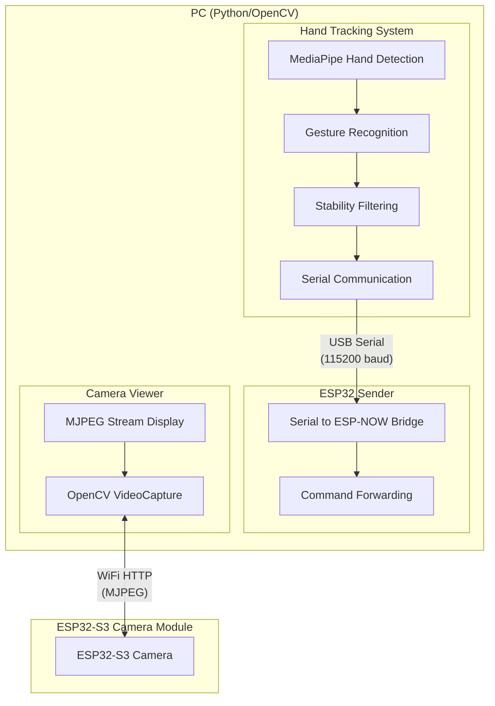
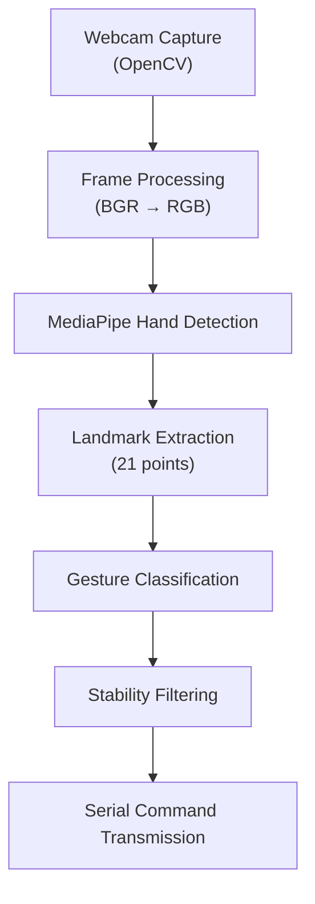
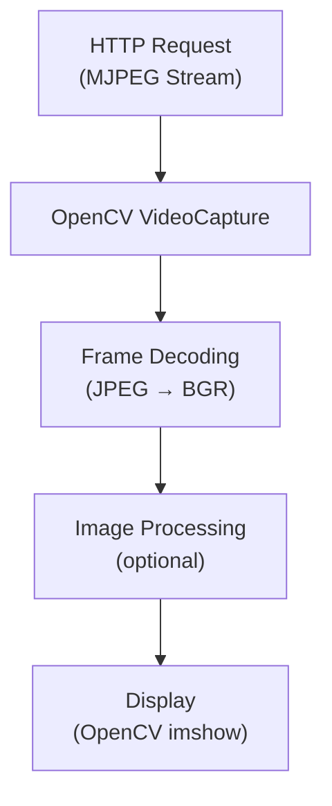
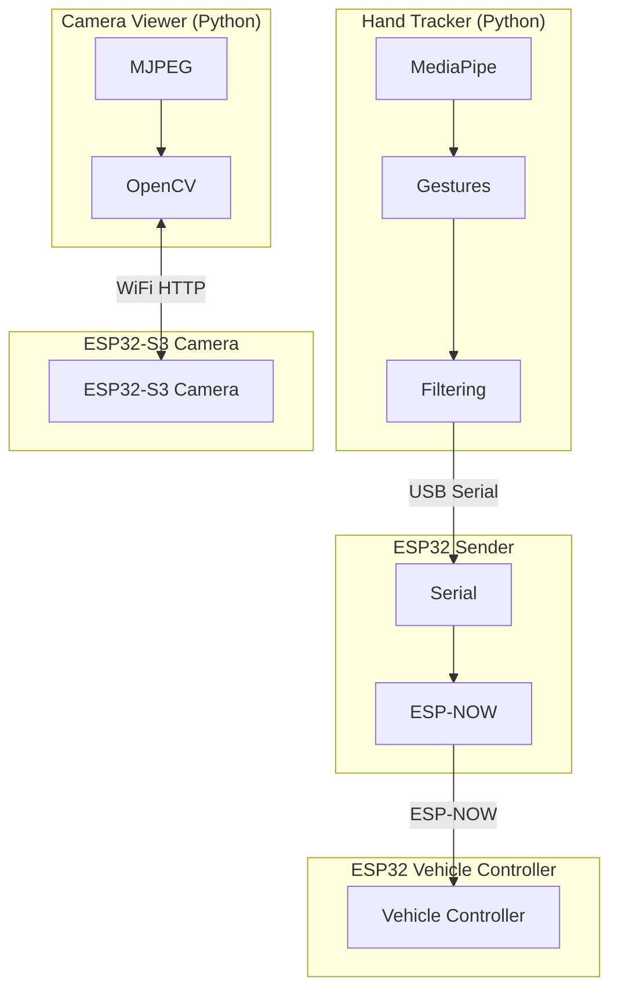

# PC Side Components - Technical Documentation

Technical documentation for PC-side components: hand tracking system, camera viewer, and ESP32 sender integration.

## System Overview

The PC-side components form the **control and visualization layer** of the gesture-controlled car system:



## Hand Tracking System

### Architecture

The hand tracking system uses **Google MediaPipe** for real-time hand landmark detection and custom logic for gesture recognition.

#### Component Flow



### MediaPipe Integration

**Library**: `mediapipe==0.10.9` (specific version for compatibility)

**Key Components:**
- `mp.solutions.hands` - Hand detection solution
- `mp.solutions.drawing_utils` - Visualization utilities

**Hand Landmarks:**
MediaPipe detects 21 hand landmarks per hand:
- Wrist (0)
- Thumb (1-4)
- Index finger (5-8)
- Middle finger (9-12)
- Ring finger (13-16)
- Pinky (17-20)

### Gesture Recognition Algorithm

#### Gesture Detection Logic

The system uses a **decision tree** approach:

1. **Primary Gestures** (checked first):
   - Index finger up → `Forward`
   - Closed fist → `Stop`
   - Index finger down → `Backward`
   - Circle gestures → `rotate_cw` / `rotate_ccw`

2. **Position-Based Gestures** (if hand is open):
   - Calculate hand center position
   - Calculate angle from screen center
   - Map angle to direction:
     - 0° → `Sideway_Right`
     - 45° → `diagonal_forward_right`
     - 90° → `Forward`
     - 135° → `diagonal_forward_left`
     - 180° → `Sideway_Left`
     - -135° → `diagonal_backward_left`
     - -90° → `Backward`
     - -45° → `diagonal_backward_right`

3. **Center Gesture**:
   - Hand open AND within center threshold → `Center`

#### Gesture Functions

**Finger State Detection:**
```python
def is_index_finger_up(landmarks):
    # Index finger tip (8) above PIP (6)
    # Other fingers bent
    return (landmarks[8].y < landmarks[6].y and
            landmarks[12].y > landmarks[10].y and
            landmarks[16].y > landmarks[14].y and
            landmarks[20].y > landmarks[18].y)
```

**Circle Detection:**
```python
def is_circle_cw(landmarks, width, height):
    # Thumb (4) and index (8) form circle
    # Calculate distance and angle
    # Check for circular motion pattern
```

**Direction Calculation:**
```python
def get_direction_label(angle_deg):
    # Map angle to 8-direction compass
    # Returns: Forward, Backward, Sideway_Left, etc.
```

### Stability Filtering

**Purpose**: Prevent command jitter from noisy gesture detection

**Algorithm:**
1. Track last detected gesture
2. Count consecutive frames with same gesture
3. Only send command after threshold (default: 10 frames)
4. Reset counter on gesture change

**Implementation:**
```python
stable_threshold = 10  # Frames needed

if detected_label == last_detected:
    stable_counter += 1
else:
    stable_counter = 0
    last_detected = detected_label

if stable_counter >= stable_threshold:
    # Send command
    send_command(detected_label)
```

**Trade-offs:**
- **Lower threshold**: Faster response, more jitter
- **Higher threshold**: Slower response, more stable

### Serial Communication Protocol

#### Protocol Format

**Text-based protocol** for simplicity:

```
Command String + '\n'
```

**Example:**
```
Forward\n
Stop\n
rotate_cw\n
```

#### Serial Configuration

- **Baud Rate**: 115200
- **Data Bits**: 8
- **Stop Bits**: 1
- **Parity**: None
- **Timeout**: 0.1 seconds

#### Error Handling

- **Connection Failure**: Graceful degradation (camera-only mode)
- **Write Errors**: Try-catch with error logging
- **Read Errors**: Non-blocking read with timeout

### Performance Characteristics

- **Frame Rate**: 30+ FPS (depends on camera and CPU)
- **Latency**: < 50ms (capture → command)
- **CPU Usage**: 20-40% (depends on resolution)
- **Memory**: ~100MB (MediaPipe + OpenCV)

## Camera Viewer

### Architecture

The camera viewer connects to the ESP32-S3 camera stream via HTTP and displays it using OpenCV.

#### Component Flow



### MJPEG Stream Protocol

**Format**: `multipart/x-mixed-replace`

**Structure:**
```
HTTP/1.1 200 OK
Content-Type: multipart/x-mixed-replace; boundary=frame

--frame
Content-Type: image/jpeg
Content-Length: <size>

<JPEG data>
--frame
Content-Type: image/jpeg
Content-Length: <size>

<JPEG data>
...
```

### OpenCV Integration

**Library**: `opencv-python>=4.5.0`

**Key Functions:**
- `cv2.VideoCapture(url)` - Open MJPEG stream
- `cap.read()` - Read frame
- `cv2.imshow()` - Display frame
- `cv2.flip()` - Image transformation

**Stream URL Format:**
```python
stream_url = f"http://{esp32_ip}/stream"
cap = cv2.VideoCapture(stream_url)
```

### Image Processing

**Current Processing:**
- Vertical flip (optional, for camera orientation)

**Potential Enhancements:**
- Resize for performance
- Color correction
- Overlay information (FPS, status)
- Recording to file

### Performance

- **Frame Rate**: 10-30 FPS (depends on network and ESP32)
- **Latency**: 100-500ms (network dependent)
- **CPU Usage**: 5-15% (decoding + display)
- **Memory**: ~50MB (OpenCV buffers)

## ESP32 Sender Integration

### Communication Flow

```
Hand Tracker (Python)
    ↓ USB Serial (text)
ESP32 Sender (Arduino)
    ↓ ESP-NOW (binary)
Vehicle Controller (ESP32)
```

### Protocol Conversion

**Text to Binary Conversion:**

The sender receives text strings but the vehicle expects binary bytes. The conversion happens in the vehicle controller's communication task:

```
Text String → Command Byte
"Stop" → 0x00
"Forward" → 0x01
"Backward" → 0x02
...
```

**Note**: The current implementation sends text strings via ESP-NOW, and the vehicle controller converts them to binary internally.

### ESP-NOW Protocol

**Characteristics:**
- **Latency**: < 10ms
- **Range**: 100-200m
- **Connectionless**: No handshake
- **Reliable**: Built-in acknowledgment

**Message Format:**
```cpp
struct struct_message {
    char command[32];  // Text command string
};
```

### Error Handling

**Serial Errors:**
- Connection failure → Log warning, continue
- Write errors → Log error, retry next frame

**ESP-NOW Errors:**
- Send failure → Log error
- No acknowledgment → Log warning

## Integration Architecture

### System Communication Flow



### Synchronization

**No explicit synchronization** between components:
- Hand tracker runs independently
- Camera viewer runs independently
- Commands are asynchronous (fire-and-forget)

**Implicit synchronization:**
- Gesture stability filter provides temporal smoothing
- Vehicle controller timeout prevents stale commands

## Performance Optimization

### Hand Tracking Optimization

1. **Reduce Resolution**: Lower camera resolution = higher FPS
2. **Skip Frames**: Process every Nth frame if needed
3. **Reduce MediaPipe Complexity**: Use lighter model if available
4. **Optimize Image Processing**: Minimize BGR↔RGB conversions

### Camera Viewer Optimization

1. **Reduce Display Size**: Smaller window = less processing
2. **Skip Frames**: Display every Nth frame
3. **Lower Stream Quality**: Reduce JPEG quality on ESP32
4. **Network Optimization**: Use wired connection if possible

### System-Level Optimization

1. **Separate Processes**: Run hand tracker and camera viewer in separate processes
2. **Threading**: Use threading for I/O operations
3. **Hardware Acceleration**: Use GPU for OpenCV if available
4. **Network**: Use 5GHz WiFi for camera (if ESP32-S3 supports it)

## Debugging and Monitoring

### Hand Tracker Debugging

**Serial Output:**
```python
print(f"Sent to ESP32: {command}")
print(f"Detected (no serial): {gesture}")
```

**Visual Debugging:**
- Hand landmarks drawn on frame
- Gesture label displayed
- Direction line shown

### Camera Viewer Debugging

**Connection Status:**
```python
if not cap.isOpened():
    print("[ERROR] Could not open video stream")
```

**Frame Status:**
```python
ret, frame = cap.read()
if not ret:
    print("[WARNING] Failed to read frame")
```

### System Monitoring

**Serial Monitor (ESP32 Sender):**
- Command reception confirmation
- ESP-NOW send status
- Error messages

**Performance Monitoring:**
- Frame rate (FPS) calculation
- Latency measurement
- CPU/memory usage

## API Reference

### Hand Tracker Functions

#### `is_hand_closed(landmarks)`
Check if hand is closed (fist).

**Parameters:**
- `landmarks`: MediaPipe hand landmarks (21 points)

**Returns:** `True` if all fingers bent

#### `is_index_finger_up(landmarks)`
Check if index finger is extended upward.

**Returns:** `True` if index finger up, others bent

#### `get_direction_label(angle_deg)`
Get direction label from angle.

**Parameters:**
- `angle_deg`: Angle in degrees (-180 to 180)

**Returns:** Direction string (e.g., "Forward", "Sideway_Left")

### Camera Viewer Functions

#### `get_stream_url(ip_override)`
Build stream URL from IP address.

**Parameters:**
- `ip_override`: Optional IP address override

**Returns:** Stream URL string

#### `main()`
Main viewer loop (capture → display).

## Future Enhancements

### Hand Tracking

1. **Multi-Hand Support**: Detect and track multiple hands
2. **3D Gestures**: Use depth information for 3D gestures
3. **Machine Learning**: Train custom gesture classifier
4. **Gesture Sequences**: Recognize gesture patterns/sequences

### Camera Viewer

1. **Recording**: Record stream to file
2. **Overlays**: Add FPS, timestamp, status overlays
3. **Multiple Streams**: Support multiple camera streams
4. **Web Interface**: HTML5-based viewer

### System Integration

1. **Unified Interface**: Single application for hand tracking + camera
2. **Configuration GUI**: Graphical configuration interface
3. **Logging**: Comprehensive logging system
4. **Telemetry**: Display vehicle status from telemetry stream

---

**For user-facing documentation, see component-specific READMEs:**
- [Hand Tracking README](../pc_side/Hand_Tracking/README.md)
- [Camera Module README](../pc_side/ESP_Camera_Module/README.md)
- [Sender README](../pc_side/Sender_Code/README.md)

