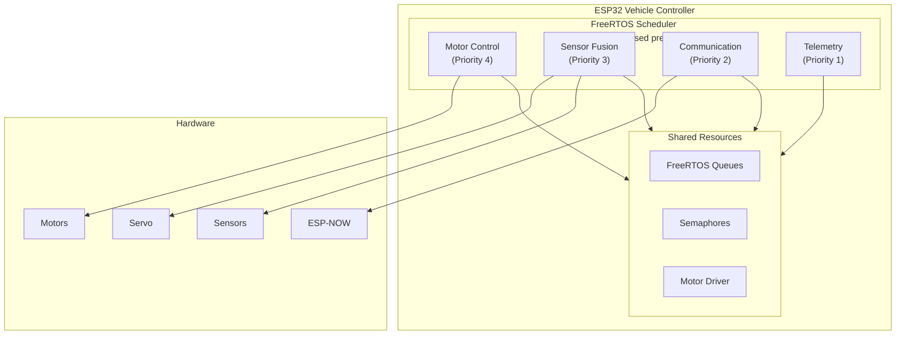
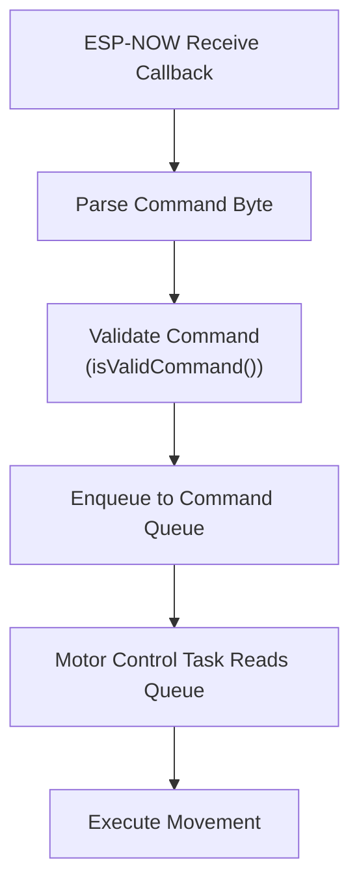

# Vehicle Controller - Technical Documentation

Detailed technical documentation for the ESP32 vehicle controller system, including architecture, protocols, and API reference.

## Architecture Overview

The vehicle controller is built on **FreeRTOS**, a real-time operating system that enables concurrent task execution. The system uses a multi-task architecture with priority-based scheduling.

### System Architecture Diagram



## FreeRTOS Task Architecture

### Task Priorities

Tasks are prioritized from 1 (lowest) to 5 (highest). Higher priority tasks preempt lower priority tasks.

| Task | Priority | Period | Frequency | Purpose |
|------|----------|--------|-----------|---------|
| Safety Monitor | 5 | 50ms | 20 Hz | Emergency stop, obstacle detection |
| Motor Control | 4 | 10ms | 100 Hz | Real-time motor PWM control |
| Sensor Fusion | 3 | 50ms | 20 Hz | Ultrasonic sensor, servo control |
| Communication | 2 | 100ms | 10 Hz | ESP-NOW command reception |
| Telemetry | 1 | 100ms | 10 Hz | Status reporting, debugging |

### Task Stack Sizes

| Task | Stack Size | Notes |
|------|------------|-------|
| Safety Monitor | 2048 bytes | Moderate complexity |
| Motor Control | 4096 bytes | Complex calculations |
| Sensor Fusion | 2048 bytes | Simple sensor reads |
| Communication | 4096 bytes | ESP-NOW buffers |
| Telemetry | 2048 bytes | Simple logging |

### Task Scheduling

- **Preemptive**: Higher priority tasks interrupt lower priority tasks
- **Time-sliced**: Tasks of same priority share CPU time
- **Periodic**: Tasks run at fixed intervals using `vTaskDelayUntil()`

## Communication Protocol

### ESP-NOW Protocol

ESP-NOW is Espressif's proprietary low-latency wireless protocol operating on 2.4GHz WiFi band.

**Characteristics:**
- **Latency**: < 10ms typical
- **Range**: 100-200m line-of-sight
- **Connectionless**: No handshake required
- **Reliable**: Built-in acknowledgment (optional)

### Command Protocol

The system uses a **binary single-byte command protocol** for efficiency.

#### Command Byte Definitions

```cpp
enum CommandByte {
    CMD_STOP = 0x00,
    CMD_FORWARD = 0x01,
    CMD_BACKWARD = 0x02,
    CMD_STRAFE_LEFT = 0x03,
    CMD_STRAFE_RIGHT = 0x04,
    CMD_ROTATE_CW = 0x05,
    CMD_ROTATE_CCW = 0x06,
    CMD_DIAGONAL_FORWARD_LEFT = 0x07,
    CMD_DIAGONAL_FORWARD_RIGHT = 0x08,
    CMD_DIAGONAL_BACKWARD_LEFT = 0x09,
    CMD_DIAGONAL_BACKWARD_RIGHT = 0x0A,
    CMD_PIVOT_LEFT = 0x0B,
    CMD_PIVOT_RIGHT = 0x0C,
    CMD_INVALID = 0xFF
};
```

#### Command Reception Flow



### Text-to-Binary Conversion

The sender transmits text strings, but the vehicle controller expects binary bytes. The conversion happens in the communication task:

```
Text String → Command Byte Mapping:
"Stop" → 0x00
"Forward" → 0x01
"Backward" → 0x02
...
```

## Motor Control System

### Motor Driver Architecture

The system uses **4 DC motors** with **2 TB6612 motor driver modules**. Each motor has its own independent PWM pin for speed control.

#### Motor Configuration

```cpp
struct MotorConfig {
    uint8_t in1_pin;  // Direction pin 1
    uint8_t in2_pin;  // Direction pin 2
    // Note: Each motor has its own PWM pin (EN pin)
};
```

#### Motor Control Method

1. **Direction Control**: Set via IN1/IN2 pins (GPIO)
2. **Speed Control**: Each motor has its own PWM pin (LEDC channel) for independent speed control
3. **Individual Control**: Each motor has independent direction pins

### Mecanum Wheel Kinematics

Mecanum wheels enable **omnidirectional movement**:

- **Forward/Backward**: All wheels same direction
- **Strafe Left/Right**: Front and back wheels opposite directions
- **Rotate**: Left and right wheels opposite directions
- **Diagonal**: Combination of forward and strafe

#### Movement Patterns

| Command | FL | FR | BL | BR |
|---------|----|----|----|----|
| Forward | F | F | F | F |
| Backward | R | R | R | R |
| Strafe Left | R | F | F | R |
| Strafe Right | F | R | R | F |
| Rotate CW | F | R | F | R |
| Rotate CCW | R | F | R | F |

**Legend**: F = Forward, R = Reverse

### PWM Control

- **Resolution**: 10-bit (0-1023)
- **Frequency**: 5000 Hz (LEDC default)
- **Common Pin**: GPIO 2 (controls all motors simultaneously)
- **Speed Range**: 0-255 (mapped to 0-1023 PWM)

## Safety Systems

### 1. Emergency Stop

**Trigger Conditions:**
- Ultrasonic sensor detects obstacle < 10cm
- Manual emergency stop command
- Safety monitor task detects critical condition

**Implementation:**
- Immediately stops all motors
- Sets emergency flag
- Prevents further movement until cleared

### 2. Watchdog Timer

**Purpose**: Detect system hangs or task failures

**Configuration:**
- **Timeout**: 5000ms (5 seconds)
- **Reset**: Motor control task feeds watchdog
- **Action**: System reset if watchdog not fed

### 3. Timeout Monitor

**Purpose**: Auto-stop if no commands received

**Configuration:**
- **Timeout**: 500ms
- **Action**: Stop all motors if no command received
- **Reset**: Cleared when new command received

### 4. Command Validation

**Purpose**: Prevent invalid commands from executing

**Implementation:**
- Validates command byte range (0x00-0x0C)
- Rejects invalid commands (0xFF)
- Logs invalid command attempts

## Sensor Integration

### Ultrasonic Sensor (HC-SR04)

**Purpose**: Obstacle detection for emergency stop

**Operation:**
1. Trigger pulse on TRIG pin (GPIO 18)
2. Measure echo pulse duration on ECHO pin (GPIO 16)
3. Calculate distance: `distance = (pulse_duration * 0.034) / 2`
4. Compare to threshold (10cm)

**Limitations:**
- Minimum range: ~2cm
- Maximum range: ~400cm
- Angle: ~15° cone
- Update rate: 20 Hz (50ms period)

### Servo Motor

**Purpose**: Obstacle scanning (optional)

**Configuration:**
- **Pin**: GPIO 4
- **Range**: 0-60° (configurable)
- **Update Rate**: 20 Hz (50ms period)

**Usage**: Sweep servo to scan for obstacles in different directions

## Code Structure

### Directory Organization

```
Car/src/
├── main.cpp                    # Entry point, FreeRTOS init
├── config.h                    # Pin definitions, constants
│
├── drivers/                    # Hardware abstraction
│   ├── motor_driver.h/cpp     # Motor control
│   ├── servo_driver.h/cpp     # Servo control
│   └── ultrasonic_driver.h/cpp # Distance sensor
│
├── communication/              # Communication protocols
│   ├── command_protocol.h      # Command definitions
│   └── espnow_handler.h/cpp   # ESP-NOW implementation
│
├── control/                    # Control algorithms
│   └── motion_control.h/cpp   # Movement logic
│
├── safety/                     # Safety systems
│   ├── watchdog.h/cpp         # Watchdog timer
│   ├── timeout_monitor.h/cpp  # Command timeout
│   └── emergency_stop.h/cpp   # Emergency stop
│
├── tasks/                      # FreeRTOS tasks
│   ├── task_motor_control.cpp  # Motor control task
│   ├── task_communication.cpp # ESP-NOW task
│   ├── task_sensor_fusion.cpp  # Sensor task
│   └── task_telemetry.cpp     # Telemetry task
│
└── shared/                     # Shared resources
    ├── types.h                 # Common data structures
    └── queues.h/cpp           # FreeRTOS queues
```

### Key Components

#### MotorDriver Class

```cpp
class MotorDriver {
public:
    enum MotorID {
        MOTOR_FRONT_LEFT = 0,
        MOTOR_FRONT_RIGHT = 1,
        MOTOR_BACK_LEFT = 2,
        MOTOR_BACK_RIGHT = 3
    };
    
    bool init(const MotorConfig motors[4], 
              uint8_t enable_pin,  // PWM pin for this motor 
              uint8_t ledc_channel);
    void setMotorSpeed(uint8_t motor_id, int16_t speed);
    void stopAll();
    void setMotorSpeed(uint8_t motor_index, uint16_t duty);  // Set speed for individual motor
};
```

#### Command Protocol

```cpp
bool isValidCommand(uint8_t cmd_byte);
// Returns true if cmd_byte is in valid range (0x00-0x0C)
```

#### ESP-NOW Handler

```cpp
void espnow_init();
void espnow_receive_callback(const uint8_t *mac, 
                            const uint8_t *data, 
                            int len);
// Handles ESP-NOW message reception
```

## API Reference

### Motor Control API

#### `MotorDriver::init()`

Initialize motor driver with 4 motor configurations.

**Parameters:**
- `motors[4]`: Array of MotorConfig structures
- `enable_pin`: GPIO pin for this motor's PWM (speed control) - each motor has its own independent PWM pin
- `ledc_channel`: LEDC channel for PWM (0-15)

**Returns:** `true` if successful, `false` otherwise

#### `MotorDriver::setMotorSpeed()`

Set speed and direction for a specific motor.

**Parameters:**
- `motor_id`: Motor ID (0-3)
- `speed`: Speed from -1023 (full reverse) to +1023 (full forward), 0 = stop

**Note:** Speed is relative; actual speed depends on individual motor PWM settings

#### `MotorDriver::stopAll()`

Immediately stop all motors.

### Safety API

#### `emergency_stop_init()`

Initialize emergency stop system.

#### `emergency_stop_trigger()`

Trigger emergency stop (stops all motors).

#### `emergency_stop_clear()`

Clear emergency stop condition.

#### `watchdog_init()`

Initialize watchdog timer.

**Parameters:**
- `timeout_ms`: Watchdog timeout in milliseconds

#### `watchdog_feed()`

Feed the watchdog (call periodically from motor control task).

### Communication API

#### `espnow_init()`

Initialize ESP-NOW communication.

**Returns:** MAC address of this ESP32 (for sender configuration)

#### `isValidCommand()`

Validate command byte.

**Parameters:**
- `cmd_byte`: Command byte to validate

**Returns:** `true` if valid (0x00-0x0C), `false` otherwise

## Performance Characteristics

### Timing

- **Motor Control Loop**: 10ms (100 Hz)
- **Command Latency**: < 20ms (ESP-NOW + processing)
- **Sensor Update**: 50ms (20 Hz)
- **Safety Check**: 50ms (20 Hz)

### Resource Usage

- **Free Heap**: ~250KB typical (after initialization)
- **CPU Usage**: < 50% typical (240 MHz CPU)
- **Stack Usage**: Monitor with FreeRTOS stack high water mark

### Memory

- **Flash**: ~500KB (code + FreeRTOS)
- **RAM**: ~80KB (FreeRTOS + buffers)
- **PSRAM**: Not used (ESP32 doesn't have PSRAM)

## Debugging

### Serial Monitor

All tasks output debug messages via Serial (115200 baud):

```
[TASK_MOTOR] Motor control task started
[COMM] ESP-NOW initialized
[COMM] MAC Address: XX:XX:XX:XX:XX:XX
[COMM] Received command byte: 0x01
[MOTOR] FORWARD
```

### FreeRTOS Tools

Monitor task status:

```cpp
// Print task list
vTaskList(buffer);  // Requires configUSE_TRACE_FACILITY
```

Monitor stack usage:

```cpp
// Get stack high water mark
UBaseType_t stack = uxTaskGetStackHighWaterMark(NULL);
```

### Common Issues

1. **Stack Overflow**: Increase `TASK_STACK_SIZE_*` in config.h
2. **Watchdog Reset**: Ensure motor control task feeds watchdog
3. **Command Not Received**: Check ESP-NOW MAC address and channel
4. **Motors Don't Move**: Check pin connections and power supply

## Future Enhancements

### Potential Improvements

1. **Encoder Support**: Add wheel encoders for closed-loop velocity control
2. **PID Control**: Implement PID controllers for each motor
3. **IMU Integration**: Add inertial measurement unit for orientation
4. **Sensor Fusion**: Combine ultrasonic, IMU, and encoder data
5. **Telemetry**: Add comprehensive status reporting
6. **Battery Monitoring**: Monitor battery voltage and low-battery warning
7. **Motion Planning**: Add trajectory planning for smooth movements

### Protocol Enhancements

1. **Acknowledgment**: Add ACK/NACK for reliable communication
2. **Retry Logic**: Automatic retry for failed commands
3. **Telemetry Stream**: Bidirectional communication for status
4. **Multi-Vehicle**: Support multiple vehicles with addressing

---

**For user-facing documentation, see [Vehicle README](../Car/README.md)**

