# Project Architecture - Gesture-Controlled Car

**Version:** 2.0  
**Date:** 2025-01-27  
**Description:** Structured architecture document with visual diagrams

---

## Table of Contents

1. [System Overview](#1-system-overview)
2. [Vehicle Architecture (ESP32 Controller)](#2-vehicle-architecture-esp32-controller)
3. [PC Architecture (Hand Tracking & Camera)](#3-pc-architecture-hand-tracking--camera)
4. [Communication Flow](#4-communication-flow)

---

## 1. System Overview

### 1.1 Overview

The system is composed of **4 main components** that communicate via different protocols:

- **PC (Python)** : Gesture recognition and video display
- **ESP32 Sender** : USB Serial → ESP-NOW communication bridge
- **ESP32-S3 Camera** : WiFi video streaming module (firmware based on forked [esp32-mjpeg-multiclient-espcam-drivers](https://github.com/arkhipenko/esp32-mjpeg-multiclient-espcam-drivers) — MJPEG over HTTP, multiclient)
- **ESP32 Vehicle Controller** : Main vehicle controller with FreeRTOS

### 1.2 Global Architecture Diagram

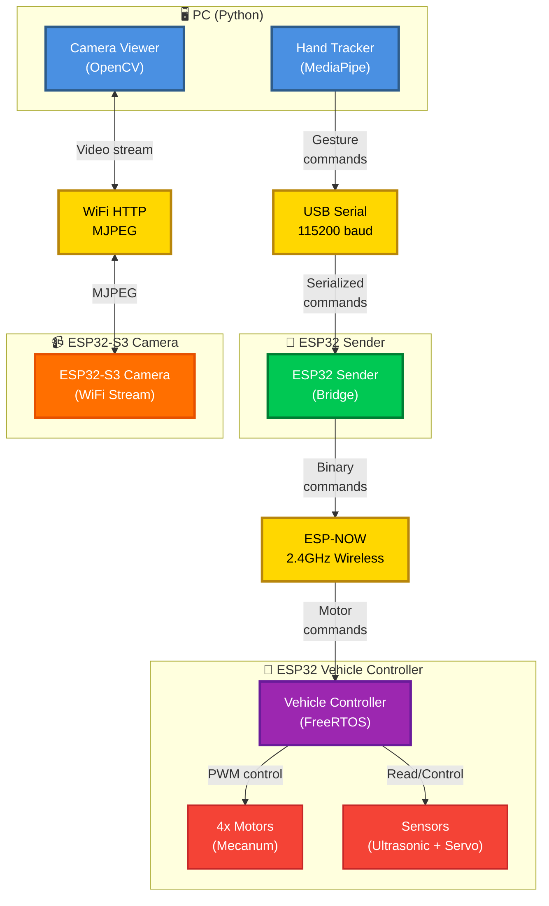

### 1.3 Architectural Principles

- **Separation of concerns** : Each component has a single role
- **Asynchronous communication** : ESP-NOW for minimal latency
- **Real-time** : FreeRTOS for motor control (< 20ms)
- **Modularity** : Task-based architecture

---

## 2. Vehicle Architecture (ESP32 Controller)

### 2.1 Controller Overview

The vehicle controller uses **FreeRTOS** to manage several concurrent tasks with different priorities. It supports **2 driving modes**: **MANUAL** and **AUTONOMOUS**.

### 2.2 Vehicle Architecture Diagram - Global View

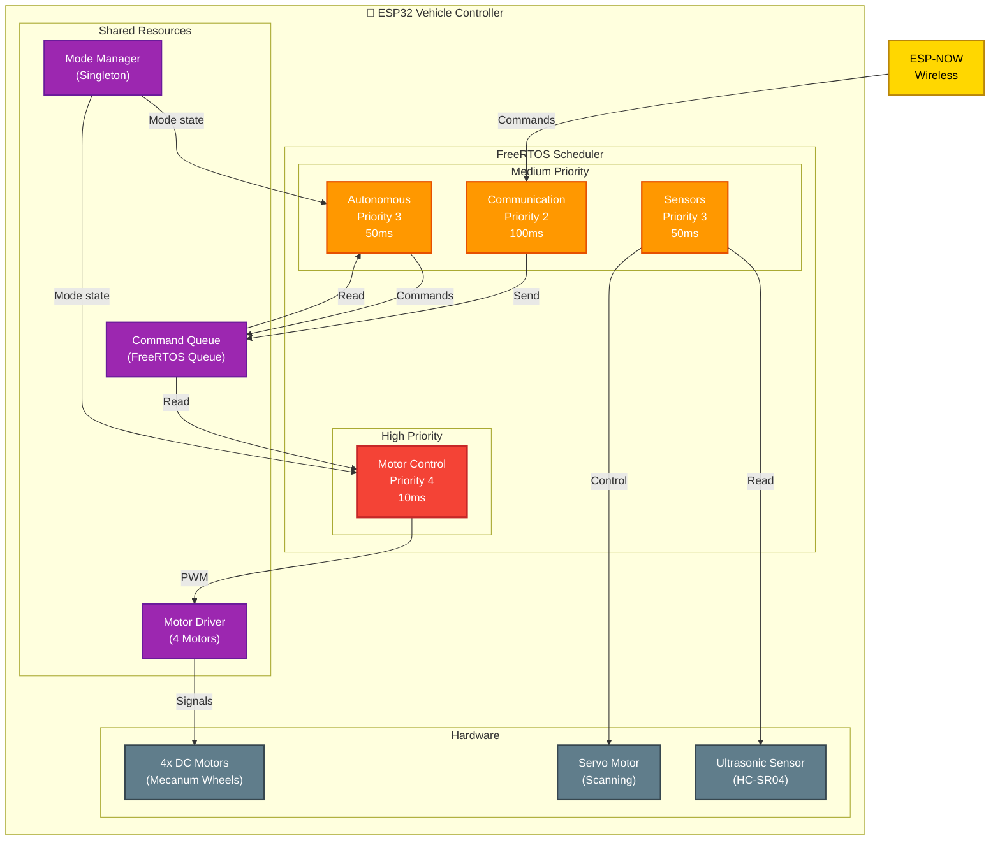

### 2.3 Task Architecture (Details)

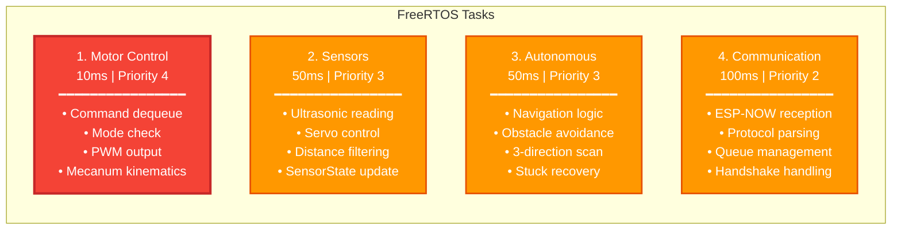

### 2.4 Driving Modes

The system supports **2 driving modes** managed by `ModeManager`:

#### Mode MANUAL
- Control via hand gestures (PC → ESP32 Sender → Vehicle)
- Commands received via ESP-NOW
- Real-time responsiveness (< 20ms)

#### Mode AUTONOMOUS
- Autonomous navigation with obstacle avoidance
- Uses ultrasonic sensor + servo for 3-direction scanning (10°, 90°, 180°)
- Stuck detection and recovery (up to 3 attempts)
- Distance from `SensorState` (updated by Sensors task); scan uses 20 samples per direction
- See [Section 8](#8-autonomous-mode---current-implementation-task_autonomouscpp) and [obstacle-detection-flow.md](architecture/obstacle-detection-flow.md) for the actual flow and constants.

### 2.5 Mode Diagram

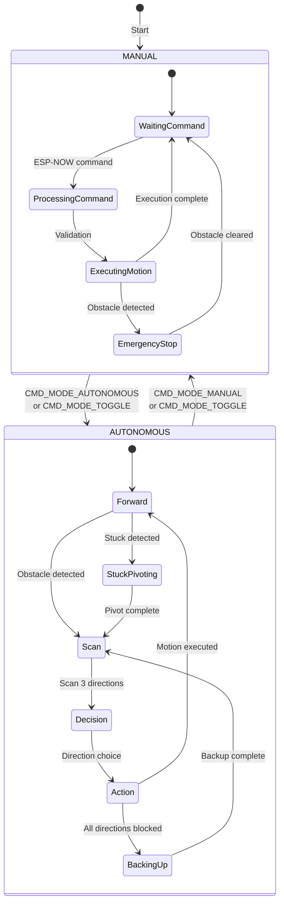

### 2.6 Data Flow - MANUAL Mode

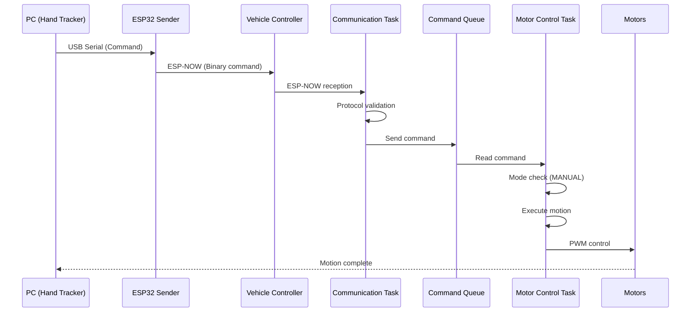

### 2.7 Data Flow - AUTONOMOUS Mode

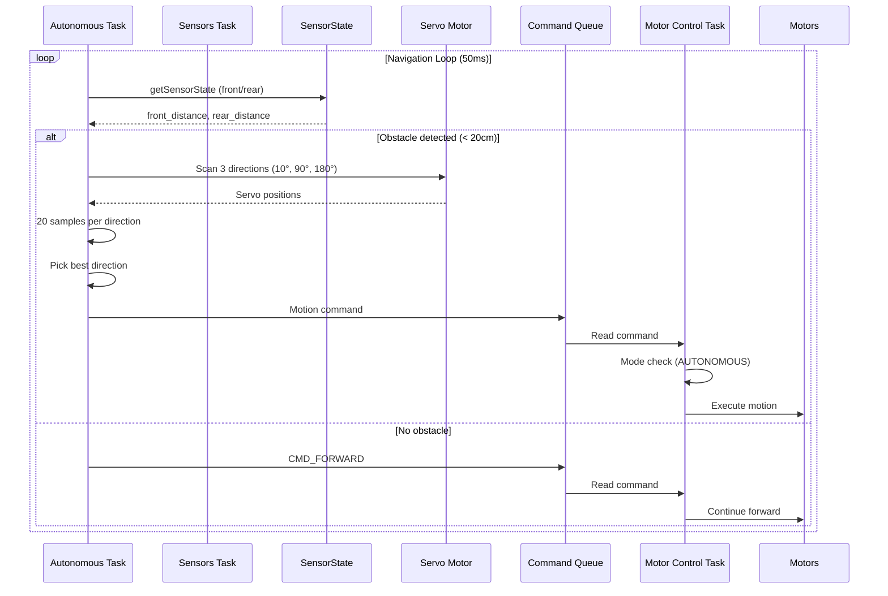

### 2.8 Software Layer Structure

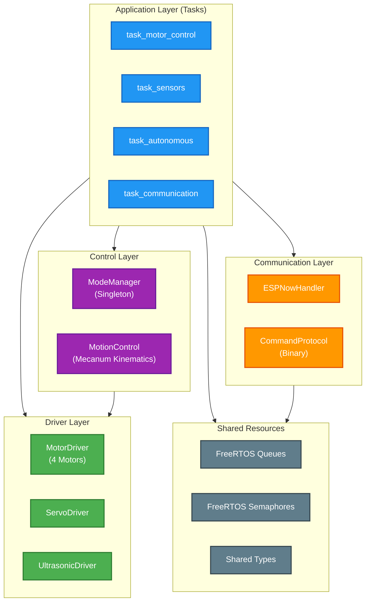

---

## 3. PC Architecture (Hand Tracking & Camera)

### 3.1 PC Overview

The PC side consists of **2 main Python applications** that run independently:

- **Hand Tracker** : Gesture recognition with MediaPipe (`pc_side/Hand_Tracking/Hand_Tracker.py`, `constant.py`)
- **Camera Viewer** : MJPEG stream display from ESP32-CAM (`pc_side/ESP-CAM/mjpeg_viewer.py`). The vehicle camera runs firmware based on the forked repo [esp32-mjpeg-multiclient-espcam-drivers](https://github.com/arkhipenko/esp32-mjpeg-multiclient-espcam-drivers) (HTTP MJPEG, supports multiple viewers).

### 3.2 PC Architecture Diagram

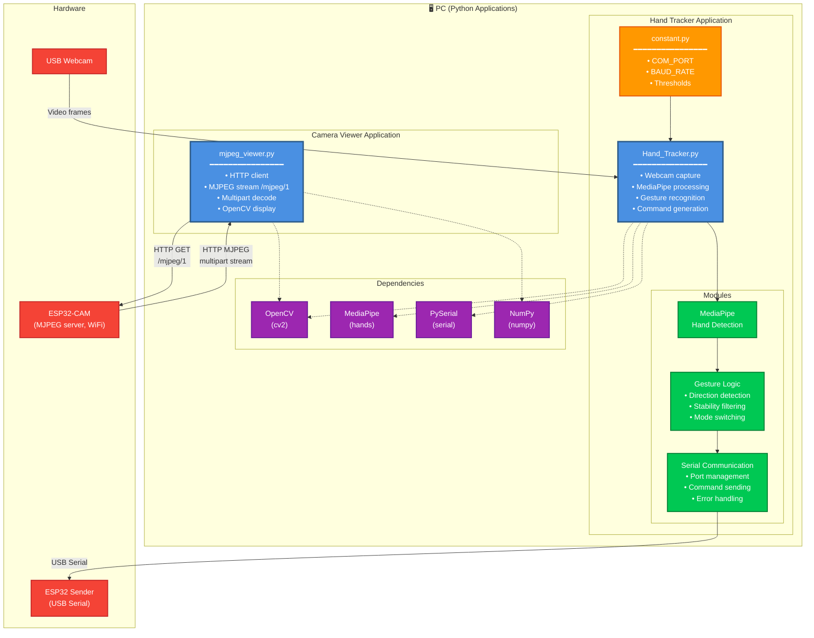

### 3.3 Processing Flow - Hand Tracker

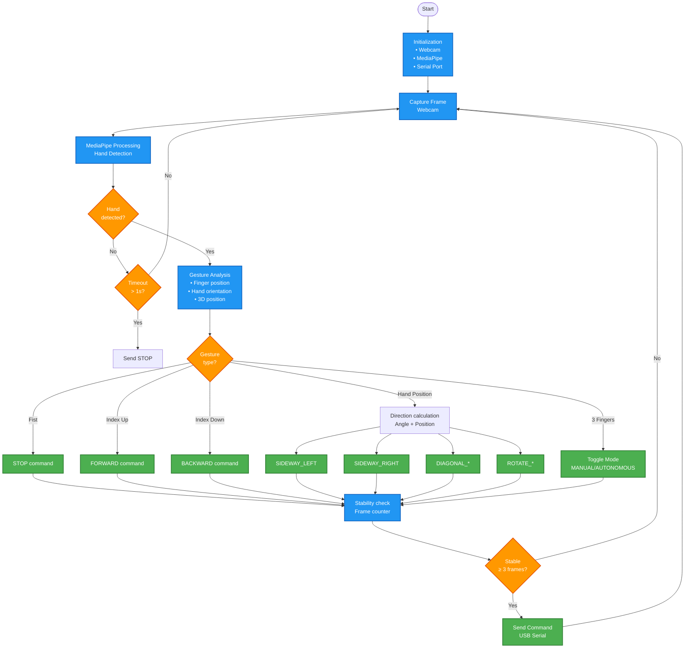

### 3.4 Gesture Commands

| Gesture | Command | Code Hex | Description |
|---------|---------|----------|-------------|
| 👊 **Fist** | `STOP` | `0x00` | Full stop |
| 👆 **Index Up** | `FORWARD` | `0x01` | Move forward |
| 👇 **Index Down** | `BACKWARD` | `0x02` | Move backward |
| ✋ **Hand Position** | `SIDEWAY_LEFT/RIGHT` | `0x03/0x04` | Sideways movement |
| 🔄 **Circle** | `ROTATE_CW/CCW` | `0x05/0x06` | Rotation |
| 📍 **Hand Position** | `DIAGONAL_*` | `0x07-0x0A` | Diagonal movements |
| ✌️ **3 Fingers** | `MODE_TOGGLE` | `0x22` | Toggle mode |

### 3.5 PC Module Architecture

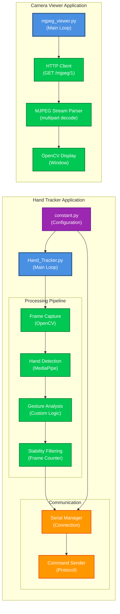

### 3.6 Camera Firmware Source

Vehicle camera streaming uses firmware based on the forked repository [arkhipenko/esp32-mjpeg-multiclient-espcam-drivers](https://github.com/arkhipenko/esp32-mjpeg-multiclient-espcam-drivers) (BSD-3-Clause). The ESP32-CAM runs an MJPEG multiclient server; the PC connects via HTTP and displays the stream with `pc_side/ESP-CAM/mjpeg_viewer.py`.

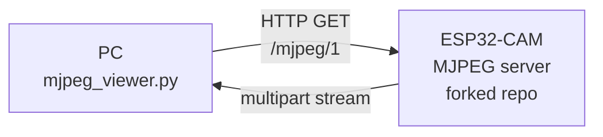

---

## 4. Communication Flow

### 4.1 Global Communication Protocol

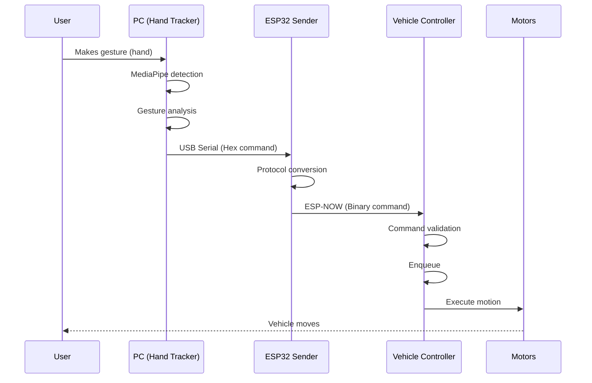

### 4.2 Binary Command Protocol

The system uses a **simple binary protocol** with single-byte commands:

```
┌─────────────────────────────────────────┐
│  Command Format (1 byte)                 │
├─────────────────────────────────────────┤
│  Byte 0: Command code (0x00 - 0xFF)     │
│                                          │
│  Motion commands:                        │
│  0x00: STOP                             │
│  0x01: FORWARD                           │
│  0x02: BACKWARD                          │
│  0x03: SIDEWAY_LEFT                      │
│  0x04: SIDEWAY_RIGHT                     │
│  0x05: ROTATE_CW                         │
│  0x06: ROTATE_CCW                        │
│  0x07-0x0A: DIAGONAL_*                   │
│  0x0B-0x0C: PIVOT_*                      │
│                                          │
│  Mode commands:                          │
│  0x20: MODE_MANUAL                       │
│  0x21: MODE_AUTONOMOUS                   │
│  0x22: MODE_TOGGLE                       │
│                                          │
│  System commands:                        │
│  0xF0: HANDSHAKE_INIT                    │
│  0xF1: HANDSHAKE_ACK                     │
│  0xF2: HEARTBEAT                         │
└─────────────────────────────────────────┘
```

### 4.3 HTTP MJPEG Camera Protocol (ESP32-CAM → PC)

The camera system uses **HTTP MJPEG** for video streaming. The vehicle camera runs firmware based on the forked repository [esp32-mjpeg-multiclient-espcam-drivers](https://github.com/arkhipenko/esp32-mjpeg-multiclient-espcam-drivers) (MJPEG multiclient server, up to 10 clients).

#### Protocol

- **Request** : HTTP GET to `http://<camera_ip>/mjpeg/1`
- **Response** : `multipart/x-mixed-replace` stream with boundary (e.g. `+++===123454321===+++`)
- **Firmware** : [arkhipenko/esp32-mjpeg-multiclient-espcam-drivers](https://github.com/arkhipenko/esp32-mjpeg-multiclient-espcam-drivers) (BSD-3-Clause)

#### HTTP MJPEG Flow

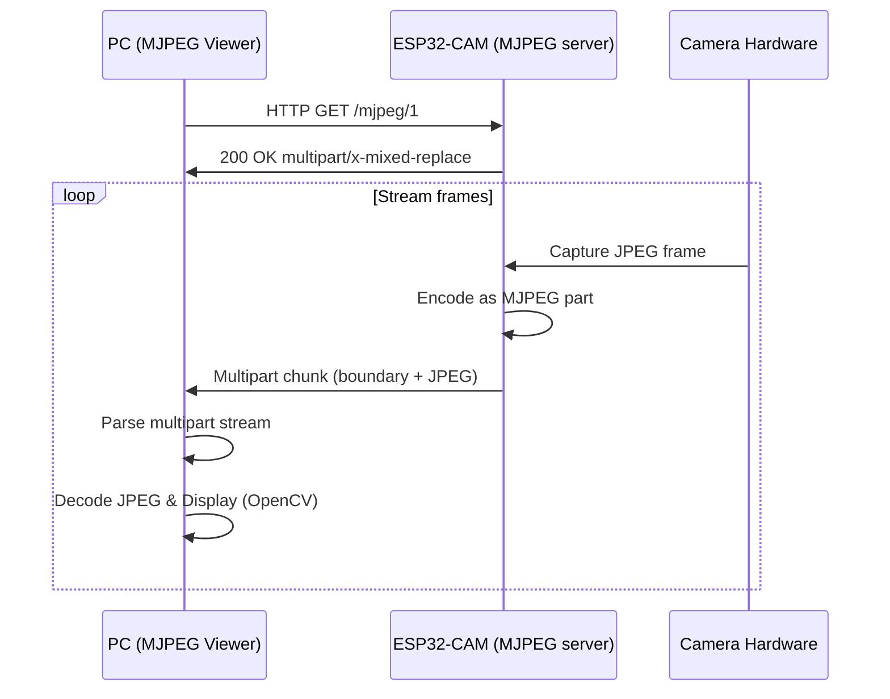

### 4.4 Detailed Communication Diagram

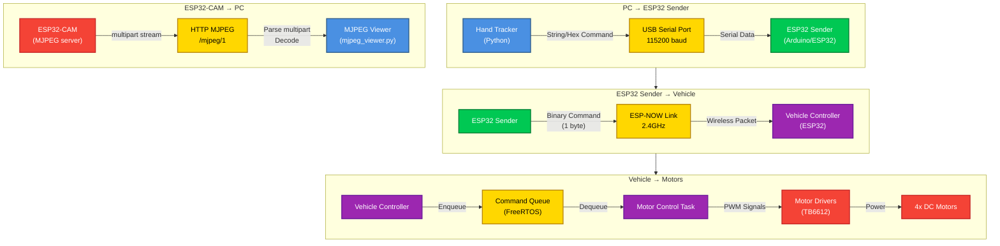

---

## 5. Technology Summary

### 5.1 Technology Stack

| Component | Technology | Version |
|-----------|-------------|---------|
| **PC** | Python | 3.10+ |
| **PC - Vision** | OpenCV | 4.5+ |
| **PC - Gestures** | MediaPipe | 0.10.9 |
| **PC - Serial** | PySerial | 3.5+ |
| **PC - Camera** | HTTP (requests) | MJPEG viewer |
| **ESP32** | ESP-IDF / Arduino | Latest |
| **RTOS** | FreeRTOS | (Included) |
| **Wireless** | ESP-NOW | 2.4GHz |
| **Camera stream** | HTTP MJPEG | esp32-mjpeg-multiclient-espcam-drivers |
| **Build System** | PlatformIO | Latest |

### 5.2 Technical Characteristics

- **Command latency** : < 20ms (PC → Motors)
- **Motor control frequency** : 100 Hz (10 ms)
- **Sensor frequency** : 20 Hz (50 ms)
- **Command protocol** : Binary (1 byte per command)
- **Camera protocol** : HTTP MJPEG
- **Vehicle communication** : ESP-NOW (no WiFi AP)
- **Camera communication** : WiFi HTTP (multipart stream, `/mjpeg/1`)
- **Architecture** : Multi-task (FreeRTOS)

---

## 6. Architecture Key Points

### 6.1 Strengths

- **Clear separation of concerns**  
- **Modular and extensible architecture**  
- **Real-time guarantee (FreeRTOS)**  
- **Efficient binary protocol**  
- **Integrated safety system**  
- **Multi-mode support (MANUAL/AUTONOMOUS)**

### 6.2 Points of Attention

- **ESP-NOW has no delivery guarantee** (no ACK currently)  
- **Limited ESP32 resources** (RAM/Flash)  
- **Variable network latency** (WiFi interference possible)  
- **Configuration spread across** (constant.py, config.h); autonomous timings/thresholds are hardcoded in `task_autonomous.cpp`, not in config.h

---

---

## 7. Autonomous Mode - Conceptual Simplified Design (Not Implemented)

This section describes a **conceptual** simplified 3-state FSM design. The **current** implementation is in [Section 8](#8-autonomous-mode---current-implementation-task_autonomouscpp) and in `Vehicule/src/tasks/task_autonomous.cpp`. The codebase does **not** contain separate `obstacle_detection/` or `navigation/` modules; autonomous logic lives in `task_autonomous.cpp` with hardcoded timings and thresholds (not in `config.h`).

### 7.1 Overview (Conceptual)

The conceptual design uses a simplified state machine (FSM) with 3 states for obstacle-avoidance navigation:
- **3 states** instead of 7
- **1 recovery strategy** instead of 5
- **Stuck detection** based on timeout instead of complex methods

### 7.2 Conceptual FSM Diagram (3 States)

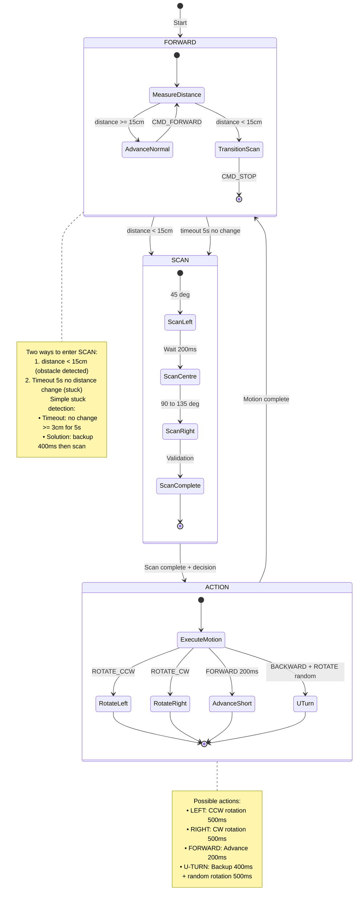

### 7.2.1 Conceptual Flow - Overview

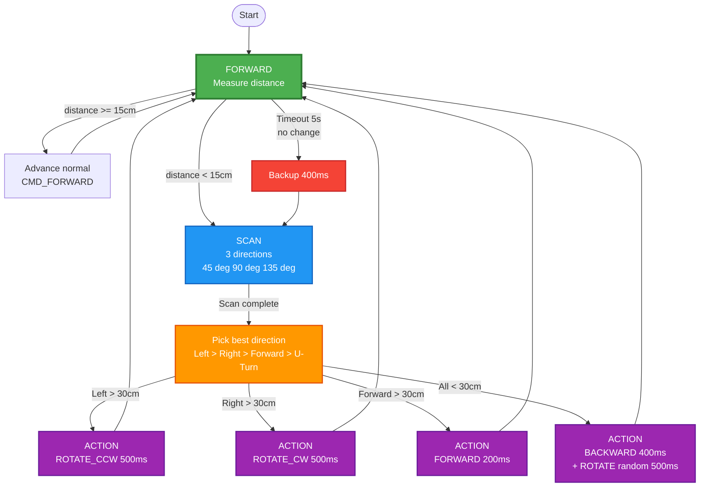

### 7.2.2 Conceptual Comparison (Before / After)

| Aspect | Before | After (conceptual) |
|--------|--------|---------------------|
| **States** | 7 (FORWARD, SCAN, DECISION, ACTION, BACKING_UP, STUCK_PIVOTING, STOPPED) | 3 (FORWARD, SCAN, ACTION) |
| **Recovery strategies** | 5 (BACKUP_TURN, PIVOT_360, BACKUP_LONG, RANDOM_TURN, WALL_FOLLOW) | 1 (Backup + random rotation) |
| **Modules** | 6 (conceptual) | 3 (conceptual; not present in repo) |
| **Stuck detection** | Variance, oscillation, position tracking | Simple timeout (5s no change) |

*Note: The current codebase implements autonomous logic in a single task (`task_autonomous.cpp`) with hardcoded values; it does not use separate `obstacle_detection/` or `navigation/` modules or AUTO_* defines in config.h. See Section 8 and [obstacle-detection-flow.md](architecture/obstacle-detection-flow.md).*

### 7.3 Conceptual Processing Pipeline

```
┌──────────────┐
│ Ultrasonic   │
│ Raw Reading  │
└──────┬───────┘
       ↓
┌──────────────┐
│ SensorFilter │ ← Median filter (buffer=3)
│ (median)     │
└──────┬───────┘
       ↓
┌──────────────┐
│ Position     │
│ Tracker      │ → Motion detection
└──────┬───────┘
       ↓
┌──────────────┐
│ Stuck        │
│ Detector     │ → Variance + Oscillations
└──────┬───────┘
       ↓
┌──────────────┐
│ Navigation   │
│ FSM          │ → Decision + Action
└──────────────┘
```

*The above pipeline is conceptual. The actual implementation uses `SensorState` (updated by `task_sensors`) and inline scan/decision logic in `task_autonomous.cpp`.*

### 7.4 Conceptual Modules (Not in Repo)

The following modules are **not** present in the repository. Autonomous logic is implemented directly in `task_autonomous.cpp` (see Section 8).

#### SensorFilter (conceptual)
- **Role** : Remove ultrasonic sensor spikes
- **Algorithm** : Median filter (circular buffer n=3)

#### ObstacleScanner (conceptual)
- **Role** : Scan environment (3 directions)
- **Angles** : Conceptual 45° / 90° / 135°; actual code uses 10° / 90° / 180°

#### NavigationStateMachine (conceptual)
- **Role** : Orchestrate navigation
- **States** : 3 states (FORWARD, SCAN, ACTION)

#### DirectionDecider (conceptual)
- **Role** : Pick best direction
- **Criterion** : Max distance among free directions

### 7.5 Configuration (Actual vs Conceptual)

**Actual:** [Vehicule/src/config.h](Vehicule/src/config.h) contains task periods and hardware pins but **no** AUTO_* autonomous parameters. Obstacle threshold (20 cm), rear threshold (15 cm), stuck threshold (40 cm), backup (800 ms), turn (1200 ms), recovery (800 ms), and scan angles (10°, 90°, 180°) are **hardcoded** in [task_autonomous.cpp](Vehicule/src/tasks/task_autonomous.cpp).

### 7.6 Conceptual Performance

- **Scan time** : 600–800 ms (3 directions)
- **Decision time** : < 10 ms
- **Total reaction** : < 1000 ms (detection → action)
- **Cycle period** : 50 ms (20 Hz)

### 7.7 Conceptual Stuck Detection

Conceptual simplified stuck detection (not all implemented as described):

#### Two Ways to Enter SCAN

**1. Distance < 15 cm (Obstacle detected)**  
   - Vehicle measures front distance; if below threshold → stop and transition to SCAN.

**2. Timeout with no change (Stuck detected)**  
   - Condition: No distance change ≥ 3 cm for 5 s.  
   - Solution: Backup 400 ms then transition to SCAN.

#### Conceptual Block Recovery Flow

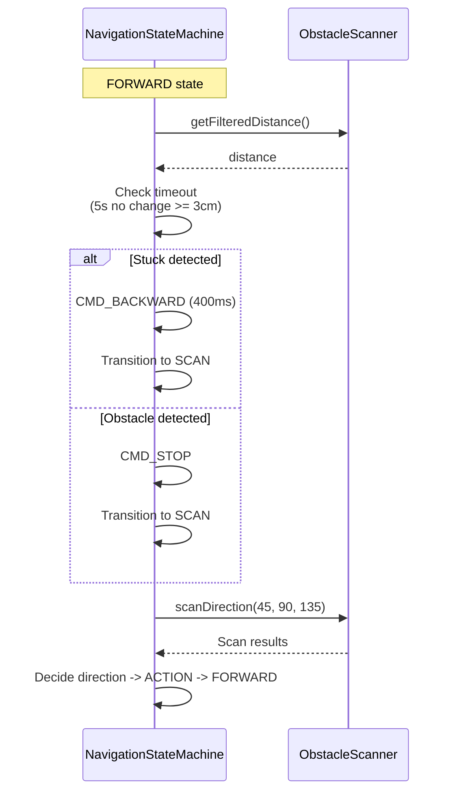

#### Advantages of Simplification (conceptual)

1. **Fewer false positives** : Simple timeout instead of multiple complex methods  
2. **Easier to debug** : Clear, direct logic  
3. **Fewer resources** : No circular buffers or complex history  
4. **Fast recovery** : Backup then scan to find a new path

---

## 8. Autonomous Mode - Current Implementation (`task_autonomous.cpp`)

See also: [obstacle-detection-flow.md](architecture/obstacle-detection-flow.md) for a concise flow and constants.

### 8.1 Overview

Autonomous mode is implemented directly in the FreeRTOS task `task_autonomous` (file `Vehicule/src/tasks/task_autonomous.cpp`). The logic follows a simple loop:

- **Advance in short steps** in a straight line.
- **Read front distance** from `SensorState` (updated by the Sensors task).
- **Trigger avoidance** when an obstacle is detected below a fixed threshold (< 20 cm).
- **Scan 3 directions** (10°, 90°, 180° — right, center, left) with the servo; 20 samples per direction.
- **Pick the clearest direction** and execute the corresponding rotation (1200 ms turn, 800 ms recovery rotate).
- **Apply "stuck" recovery** (up to 3 attempts, 800 ms each) if max distance ≤ 40 cm.

This implementation is intentionally **blocking and local** to the autonomous task for simplicity. Autonomous timings and thresholds are **hardcoded** in `task_autonomous.cpp`; [config.h](Vehicule/src/config.h) does not define AUTO_* parameters.

### 8.2 Flow Diagram - `task_autonomous`

```mermaid
flowchart TD
    Start([Task start]) --> WaitSetup[Wait setupComplete]
    WaitSetup --> Loop{Mode AUTONOMOUS ?}
    
    Loop -->|No| Idle[Short sleep<br/>(20 ms)]
    Idle --> Loop
    
    Loop -->|Yes| ForwardStep[Send CMD_FORWARD<br/>+ delay 60 ms]
    ForwardStep --> Measure[Read front distance<br/>from SensorState]
    
    Measure -->|distance >= 20cm<br/>or invalid| Loop
    Measure -->|distance < 20cm| Obstacle[Obstacle detected<br/>CMD_STOP]
    
    Obstacle --> Backup[CMD_BACKWARD<br/>+ check rear via SensorState]
    Backup --> Scan[Scan 3 directions<br/>10 deg / 90 deg / 180 deg<br/>20 samples per direction]
    
    Scan --> Decide[Pick best direction<br/>max valid distance]
    
    Decide -->|max_distance > 40cm| Execute[Rotate CW/CCW<br/>1200 ms toward best direction]
    Decide -->|max_distance <= 40cm| Recovery[Recovery stuck<br/>up to 3 attempts, 800 ms each + rescan]
    
    Recovery -->|Path found| Execute
    Recovery -->|Still stuck| Stuck[CMD_STOP<br/>Stay in place]
    
    Execute --> Loop
    Stuck --> Loop
    
    style WaitSetup fill:#ECEFF1,stroke:#607D8B,stroke-width:2px,color:#000
    style Loop fill:#4CAF50,stroke:#2E7D32,stroke-width:3px,color:#fff
    style ForwardStep fill:#4CAF50,stroke:#2E7D32,stroke-width:2px,color:#fff
    style Measure fill:#2196F3,stroke:#1565C0,stroke-width:2px,color:#fff
    style Obstacle fill:#F44336,stroke:#C62828,stroke-width:2px,color:#fff
    style Backup fill:#FF9800,stroke:#E65100,stroke-width:2px,color:#fff
    style Scan fill:#9C27B0,stroke:#6A1B9A,stroke-width:2px,color:#fff
    style Decide fill:#FFC107,stroke:#FFA000,stroke-width:2px,color:#000
    style Recovery fill:#FF5722,stroke:#E64A19,stroke-width:2px,color:#fff
    style Execute fill:#8BC34A,stroke:#558B2F,stroke-width:2px,color:#fff
    style Stuck fill:#795548,stroke:#4E342E,stroke-width:2px,color:#fff
```

### 8.3 Components Used

- **Sensors**  
  - **Front distance** : Read via `getSensorState(&sensor_state)` in the main loop (`sensor_state.front_distance`). The Sensors task updates `SensorState` from the ultrasonic driver.  
  - **Rear distance** : Same `SensorState` (`sensor_state.rear_distance`); used during backup to stop if rear < 15 cm.  
  - **Scan** : Inside `scanThreeDirections(servo)`, raw readings use `readFrontSensorRaw(&raw)` (20 samples per direction).

- **Actuators**  
  - `ServoDriver servo` : Moves the ultrasonic sensor to 3 fixed angles for scan: 10° (right), 90° (center), 180° (left).  
  - `task_motor_control` (via `xCommandQueue`) : Executes `CMD_FORWARD`, `CMD_BACKWARD`, `CMD_ROTATE_CW`, `CMD_ROTATE_CCW`, `CMD_STOP`.

- **Infrastructure**  
  - `ModeManager` : Enables autonomous mode (`isAutonomousMode()`); logic is skipped when not in AUTONOMOUS.  
  - `xCommandQueue` : Shared motor command queue.  
  - `SensorState` : Shared state updated by `task_sensors`; consumed by `task_autonomous`.

### 8.4 Three-Direction Scan Algorithm

The internal function `scanThreeDirections(servo)` performs a scan in three positions:

- **Scan angles** : `{10°, 90°, 180°}` (right, center, left). Indices 0 = right, 1 = center, 2 = left.
- **Per position** :
  - Move servo to target angle (non-blocking),
  - Stabilization delay: `SENSOR_READ_INTERVAL_MS` (60 ms from [config.h](Vehicule/src/config.h)),
  - **20 samples** per direction with `SENSOR_READ_INTERVAL_MS` between reads; each sample via `readFrontSensorRaw(&raw)`.
- **Filtering** :
  - Keep only distances `0 < d < 400 cm`,
  - **Average** of valid readings per direction,
  - If no valid reading: direction stays `-1.0f` (invalid).
- At end of scan, servo is **returned to 90°** for the next cycle.

### 8.5 Best Direction Selection

The function `pickBestDirection(distances, max_distance)`:

- Iterates over the 3 directions and **ignores** invalid values (`<= 0` or `>= 400`).  
- Selects the direction with **maximum distance** and returns its index:
  - `0` : right (10°),  
  - `1` : center (90°),  
  - `2` : left (180°).
- If no valid direction is found:
  - **Defaults to center** (index 1).

Rotation is then applied as:

- `best_dir == 0` → **CW** (`CMD_ROTATE_CW`), 1200 ms.  
- `best_dir == 2` → **CCW** (`CMD_ROTATE_CCW`), 1200 ms.  
- `best_dir == 1` → no rotation; loop continues forward.

### 8.6 "Stuck" Recovery Strategy

After the scan, if max distance remains low:

- **Stuck condition** : `max_distance <= 40 cm`.  
- The algorithm enters a **recovery loop (up to 3 attempts)**:
  - Find the direction with the largest valid distance,
  - Choose motion:
    - Index 0 (right) → `CMD_ROTATE_CW`,  
    - Index 2 (left) → `CMD_ROTATE_CCW`,  
    - Index 1 (center) → `CMD_FORWARD`,  
    - Otherwise → reuse last rotation (`current_rotate_cmd`),
  - Send the command for **800 ms** (`rotate_recovery`),
  - Stop, then **full rescan**.
- If after 3 attempts max distance is **still ≤ 40 cm**:
  - System is **"stuck"**; sends `CMD_STOP` and continues the main loop.

### 8.7 Front / Rear Safety

- **Front** :
  - Obstacle threshold: **20 cm**.  
  - While `distance >= 20 cm` (or invalid), the vehicle **keeps advancing** in short steps (`CMD_FORWARD` + 60 ms delay).  
  - Below threshold: **immediate stop** (`CMD_STOP`), then backup + scan.

- **Rear** :
  - During backup, the task reads **rear distance** from `getSensorState()` every 100 ms.  
  - If `0 < rear_distance < 15 cm`, it stops backup, logs `[AUTO] Rear obstacle detected during backup` and sends `CMD_STOP`.

Backup duration is **800 ms** total (or until rear obstacle). This provides **minimal but robust** safety while keeping the autonomous code compact.

---

**Document created 2025-01-27**  
**Version 2.1 - Structured Architecture with Mermaid Diagrams + Autonomous Mode**
