# Architecture du Projet - Gesture-Controlled Car

**Version:** 2.0  
**Date:** 2025-01-27  
**Description:** Document d'architecture structuré avec schémas visuels

---

## Table des Matières

1. [Vue Globale du Système](#1-vue-globale-du-système)
2. [Architecture Véhicule (ESP32 Controller)](#2-architecture-véhicule-esp32-controller)
3. [Architecture PC (Hand Tracking & Camera)](#3-architecture-pc-hand-tracking--camera)
4. [Flux de Communication](#4-flux-de-communication)

---

## 1. Vue Globale du Système

### 1.1 Vue d'Ensemble

Le système est composé de **4 composants principaux** qui communiquent via différents protocoles :

- **PC (Python)** : Reconnaissance de gestes et visualisation vidéo
- **ESP32 Sender** : Pont de communication USB Serial → ESP-NOW
- **ESP32-S3 Camera** : Module de streaming vidéo WiFi
- **ESP32 Vehicle Controller** : Contrôleur principal du véhicule avec FreeRTOS

### 1.2 Schéma Architecture Globale

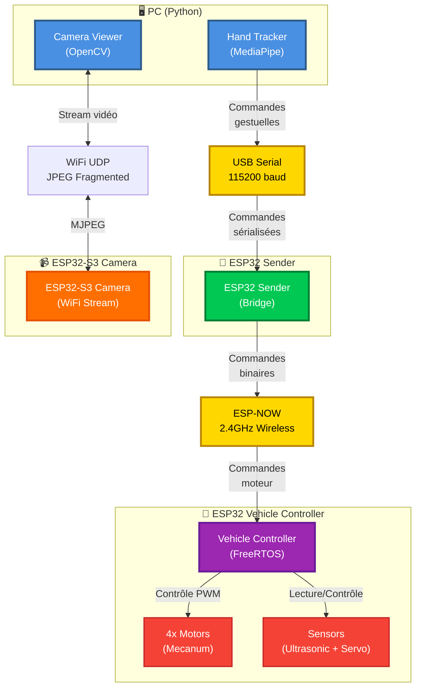

### 1.3 Principes Architecturaux

- **Séparation des responsabilités** : Chaque composant a un rôle unique
- **Communication asynchrone** : ESP-NOW pour la latence minimale
- **Temps réel** : FreeRTOS pour le contrôle moteur (< 20ms)
- **Modularité** : Architecture basée sur des tâches (tasks)

---

## 2. Architecture Véhicule (ESP32 Controller)

### 2.1 Vue d'Ensemble du Contrôleur

Le contrôleur véhicule utilise **FreeRTOS** pour gérer plusieurs tâches concurrentes avec des priorités différentes. Il supporte **2 modes de conduite** : **MANUAL** et **AUTONOMOUS**.

### 2.2 Schéma Architecture Véhicule - Vue Globale

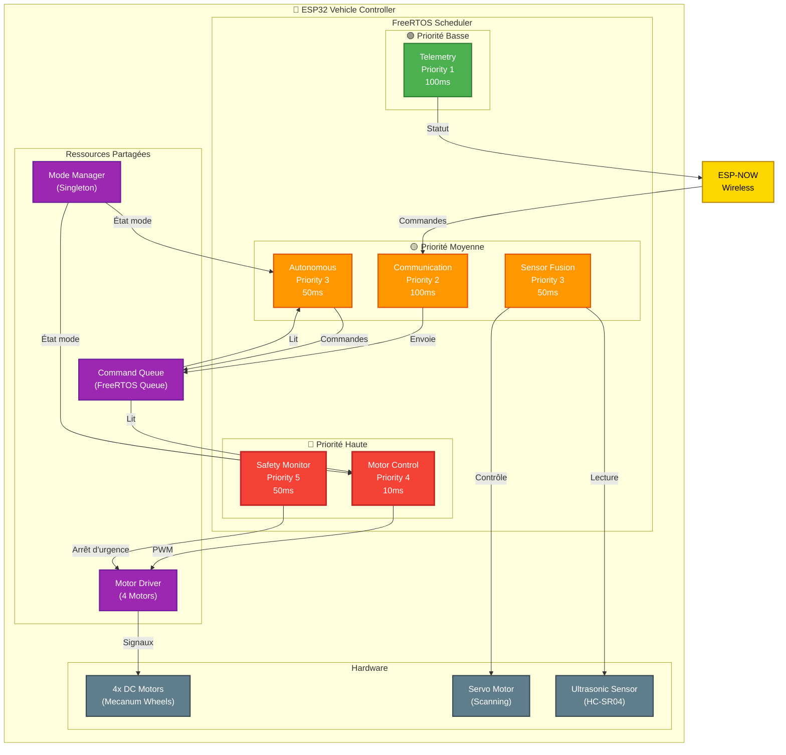

### 2.3 Architecture des Tasks (Détails)

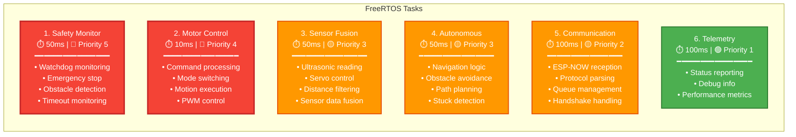

### 2.4 Modes de Conduite

Le système supporte **2 modes de conduite** gérés par le `ModeManager` :

#### Mode MANUAL
- Contrôle via gestes de la main (PC → ESP32 Sender → Vehicle)
- Commandes reçues via ESP-NOW
- Réactivité temps réel (< 20ms)

#### Mode AUTONOMOUS
- Navigation autonome avec évitement d'obstacles
- Utilise capteur ultrasonique + servo pour scanning
- Détection de blocage (stuck detection)
- Algorithme de navigation avec scan 3 directions

### 2.5 Schéma des Modes

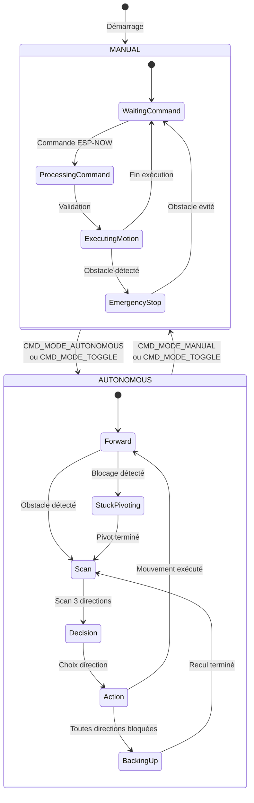

### 2.6 Flux de Données - Mode MANUAL

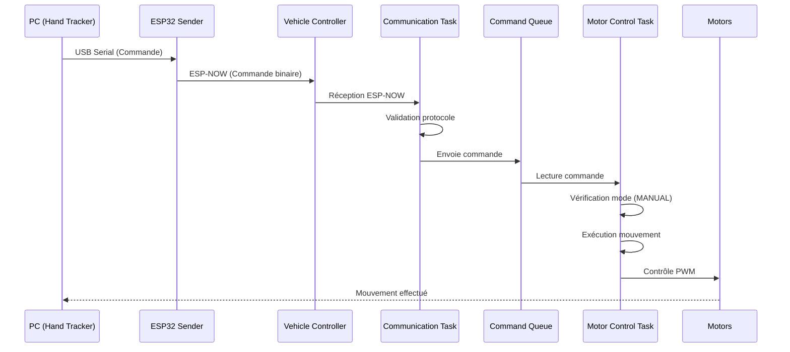

### 2.7 Flux de Données - Mode AUTONOMOUS

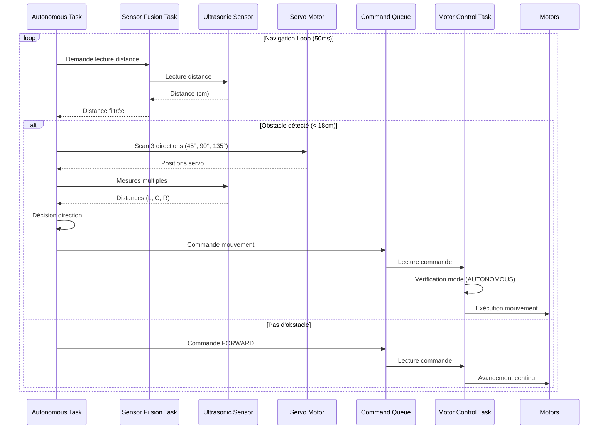

### 2.8 Structure des Couches Logiciel

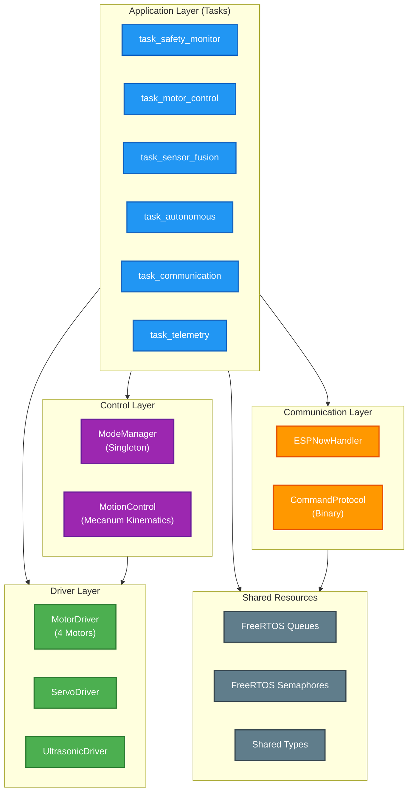

---

## 3. Architecture PC (Hand Tracking & Camera)

### 3.1 Vue d'Ensemble PC

Le côté PC est composé de **2 applications Python principales** qui fonctionnent indépendamment :

- **Hand Tracker** : Reconnaissance de gestes avec MediaPipe
- **Camera Viewer** : Visualisation du stream vidéo depuis ESP32-S3

### 3.2 Schéma Architecture PC

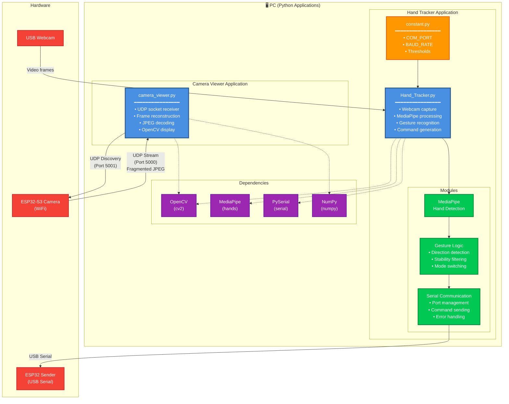

### 3.3 Flux de Traitement - Hand Tracker

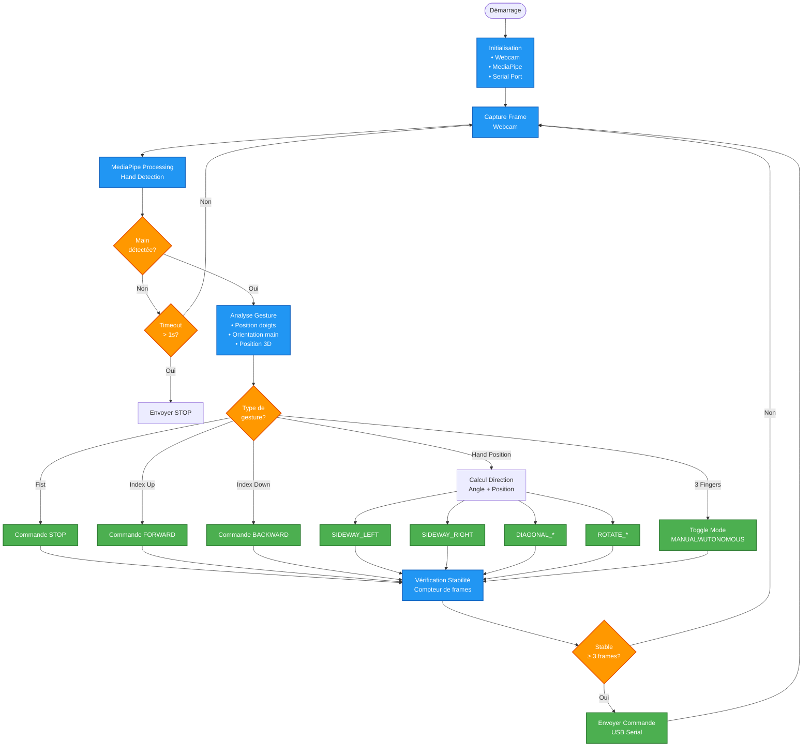

### 3.4 Commandes Gestuelles

| Gesture | Commande | Code Hex | Description |
|---------|----------|----------|-------------|
| 👊 **Fist** | `STOP` | `0x00` | Arrêt complet |
| 👆 **Index Up** | `FORWARD` | `0x01` | Avancer |
| 👇 **Index Down** | `BACKWARD` | `0x02` | Reculer |
| ✋ **Hand Position** | `SIDEWAY_LEFT/RIGHT` | `0x03/0x04` | Déplacement latéral |
| 🔄 **Circle** | `ROTATE_CW/CCW` | `0x05/0x06` | Rotation |
| 📍 **Hand Position** | `DIAGONAL_*` | `0x07-0x0A` | Mouvements diagonaux |
| ✌️ **3 Fingers** | `MODE_TOGGLE` | `0x22` | Basculer mode |

### 3.5 Architecture des Modules PC

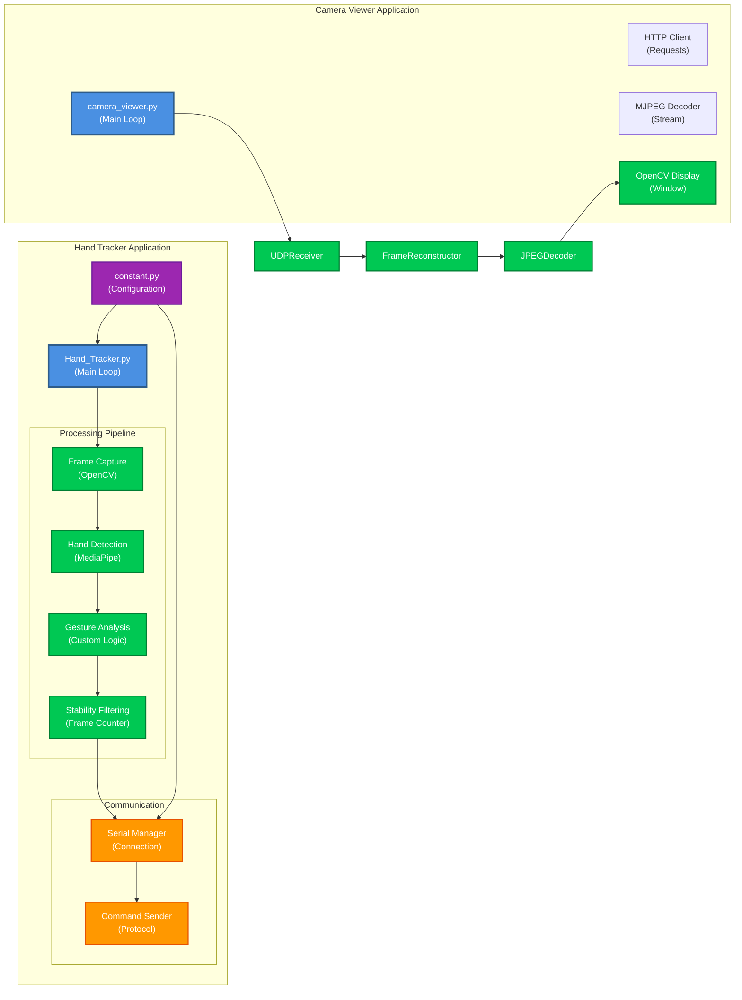

---

## 4. Flux de Communication

### 4.1 Protocole de Communication Global

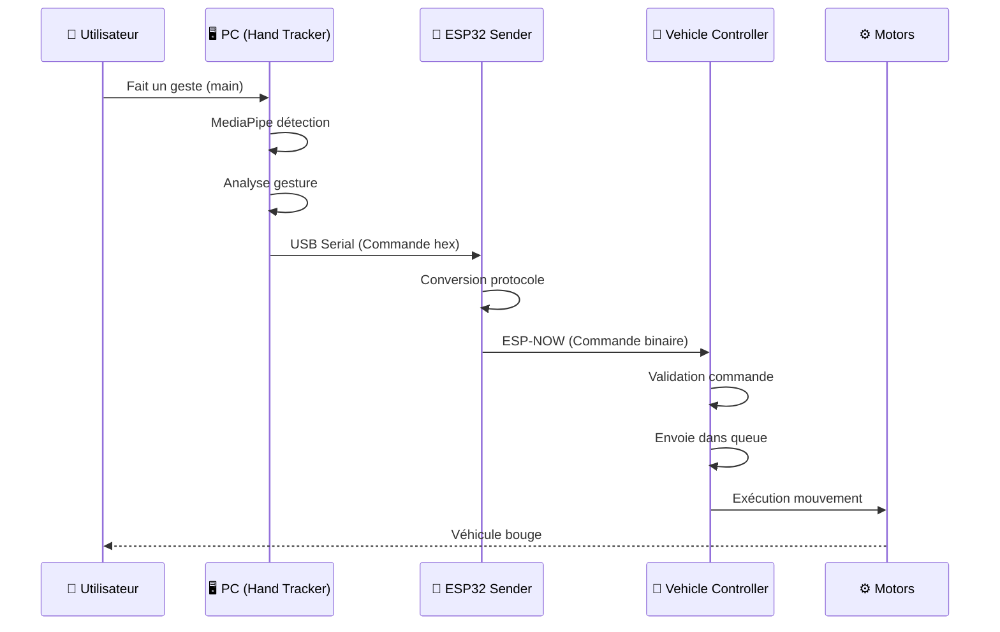

### 4.2 Protocole de Commande Binaire

Le système utilise un **protocole binaire simple** avec des commandes d'un seul byte :

```
┌─────────────────────────────────────────┐
│  Format de Commande (1 byte)            │
├─────────────────────────────────────────┤
│  Byte 0: Code Commande (0x00 - 0xFF)   │
│                                          │
│  Commandes Mouvement:                   │
│  0x00: STOP                             │
│  0x01: FORWARD                           │
│  0x02: BACKWARD                          │
│  0x03: SIDEWAY_LEFT                      │
│  0x04: SIDEWAY_RIGHT                     │
│  0x05: ROTATE_CW                         │
│  0x06: ROTATE_CCW                        │
│  0x07-0x0A: DIAGONAL_*                   │
│  0x0B-0x0C: PIVOT_*                      │
│                                          │
│  Commandes Mode:                         │
│  0x20: MODE_MANUAL                       │
│  0x21: MODE_AUTONOMOUS                   │
│  0x22: MODE_TOGGLE                       │
│                                          │
│  Commandes Système:                      │
│  0xF0: HANDSHAKE_INIT                    │
│  0xF1: HANDSHAKE_ACK                     │
│  0xF2: HEARTBEAT                         │
└─────────────────────────────────────────┘
```

### 4.3 Protocole UDP Camera (ESP32-S3 → PC)

Le système de caméra utilise **UDP** pour le streaming vidéo avec fragmentation de frames JPEG :

#### Format de Paquet UDP

```
┌─────────────────────────────────────────┐
│  Packet Header (8 bytes)                │
├─────────────────────────────────────────┤
│  frame_id:      uint32_t (4 bytes)      │
│  fragment_id:   uint16_t (2 bytes)      │
│  total_fragments: uint16_t (2 bytes)    │
├─────────────────────────────────────────┤
│  Fragment Data (max 1392 bytes)         │
│  JPEG frame data (fragmented)          │
└─────────────────────────────────────────┘
```

#### Caractéristiques

- **Port UDP** : 5000 (stream), 5001 (discovery)
- **Taille max paquet** : 1400 bytes (UDP safe size)
- **Taille data par paquet** : 1392 bytes (1400 - 8 header)
- **Fragmentation** : Frames JPEG fragmentées si > 1392 bytes
- **Reconstruction** : PC reconstruit frames depuis fragments
- **Discovery** : Broadcast UDP sur port 5001 pour auto-découverte

#### Flux UDP Camera

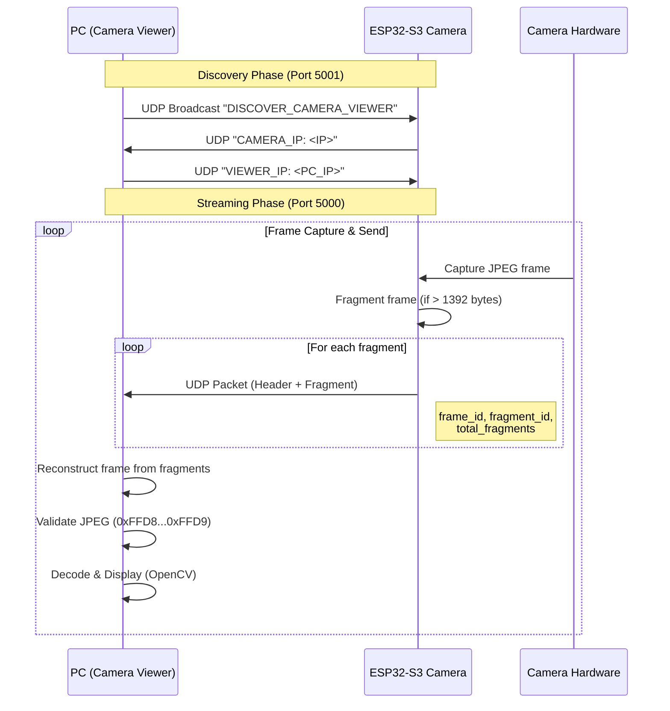

### 4.4 Schéma de Communication Détaillé

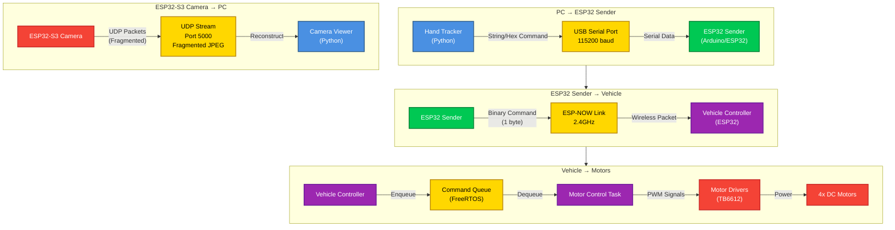

---

## 5. Résumé des Technologies

### 5.1 Stack Technique

| Composant | Technologie | Version |
|-----------|-------------|---------|
| **PC** | Python | 3.10+ |
| **PC - Vision** | OpenCV | 4.5+ |
| **PC - Gestures** | MediaPipe | 0.10.9 |
| **PC - Serial** | PySerial | 3.5+ |
| **PC - UDP** | Python socket | Standard |
| **ESP32** | ESP-IDF / Arduino | Latest |
| **RTOS** | FreeRTOS | (Included) |
| **Wireless** | ESP-NOW | 2.4GHz |
| **Wireless** | WiFi UDP | 2.4GHz |
| **Build System** | PlatformIO | Latest |

### 5.2 Caractéristiques Techniques

- **Latence commande** : < 20ms (PC → Motors)
- **Fréquence contrôle moteur** : 100Hz (10ms)
- **Fréquence capteurs** : 20Hz (50ms)
- **Protocole commandes** : Binaire (1 byte/commande)
- **Protocole caméra** : UDP (fragmented JPEG)
- **Communication véhicule** : ESP-NOW (sans WiFi AP)
- **Communication caméra** : WiFi UDP (port 5000)
- **Architecture** : Multi-tâches (FreeRTOS)

---

## 6. Points Clés de l'Architecture

### 6.1 Forces

✅ **Séparation claire des responsabilités**  
✅ **Architecture modulaire et extensible**  
✅ **Temps réel garanti (FreeRTOS)**  
✅ **Protocole binaire efficace**  
✅ **Système de sécurité intégré**  
✅ **Support multi-modes (MANUAL/AUTONOMOUS)**

### 6.2 Points d'Attention

⚠️ **ESP-NOW sans garantie de livraison** (pas d'ACK actuellement)  
⚠️ **Ressources limitées ESP32** (RAM/Flash)  
⚠️ **Latence réseau variable** (WiFi interference possible)  
⚠️ **Configuration dispersée** (constant.py, config.h)

---

**Document créé le 2025-01-27**  
**Version 2.0 - Architecture Structurée avec Schémas Mermaid**
