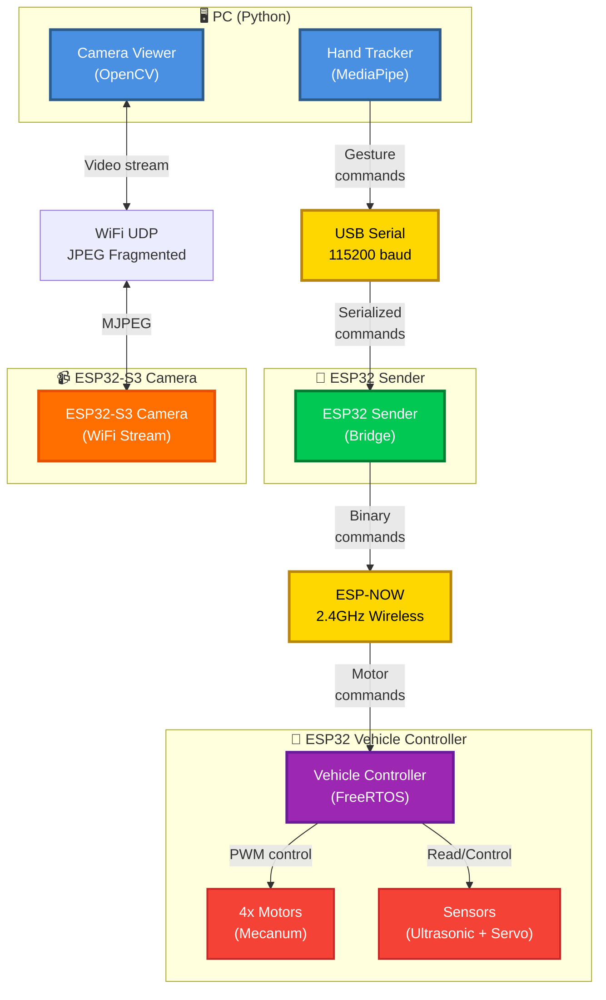

# 1. System Overview

## 1.1 Overview

The system is composed of **4 main components** that communicate via different protocols:

- **PC (Python)**: Gesture recognition and video display
- **ESP32 Sender**: Communication bridge USB Serial → ESP-NOW
- **ESP32-S3 Camera**: WiFi video streaming module
- **ESP32 Vehicle Controller**: Main vehicle controller with FreeRTOS

## 1.2 Global Architecture Diagram

## 1.3 Architectural Principles

- **Separation of concerns**: Each component has a single, well-defined role
- **Asynchronous communication**: ESP-NOW for minimal latency
- **Real-time**: FreeRTOS for motor control (< 20ms)
- **Modularity**: Task-based architecture

---
