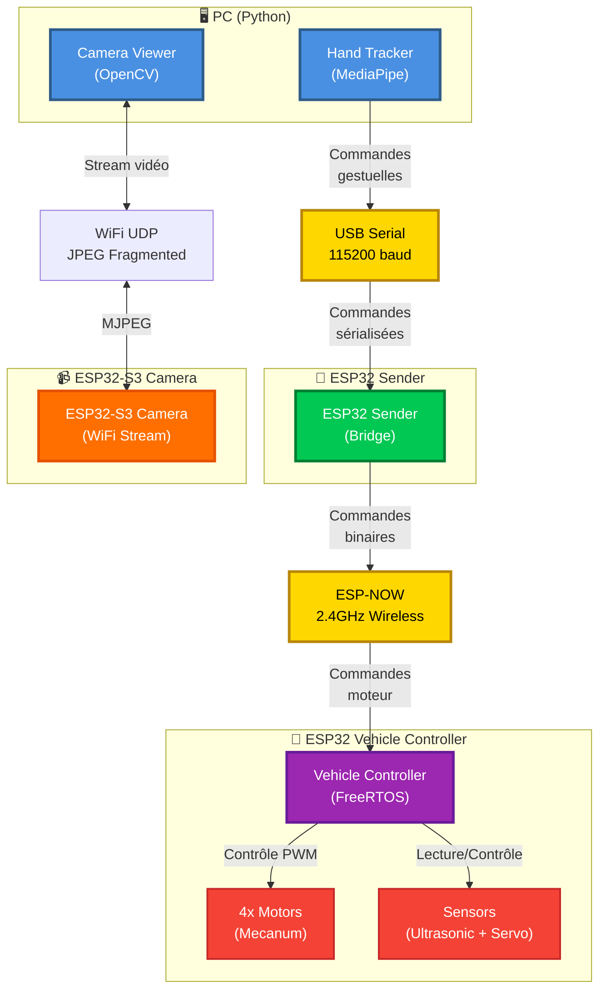

# 1. Vue Globale du Système

## 1.1 Vue d'Ensemble

Le système est composé de **4 composants principaux** qui communiquent via différents protocoles :

- **PC (Python)** : Reconnaissance de gestes et visualisation vidéo
- **ESP32 Sender** : Pont de communication USB Serial → ESP-NOW
- **ESP32-S3 Camera** : Module de streaming vidéo WiFi
- **ESP32 Vehicle Controller** : Contrôleur principal du véhicule avec FreeRTOS

## 1.2 Schéma Architecture Globale

## 1.3 Principes Architecturaux

- **Séparation des responsabilités** : Chaque composant a un rôle unique
- **Communication asynchrone** : ESP-NOW pour la latence minimale
- **Temps réel** : FreeRTOS pour le contrôle moteur (< 20ms)
- **Modularité** : Architecture basée sur des tâches (tasks)

---
