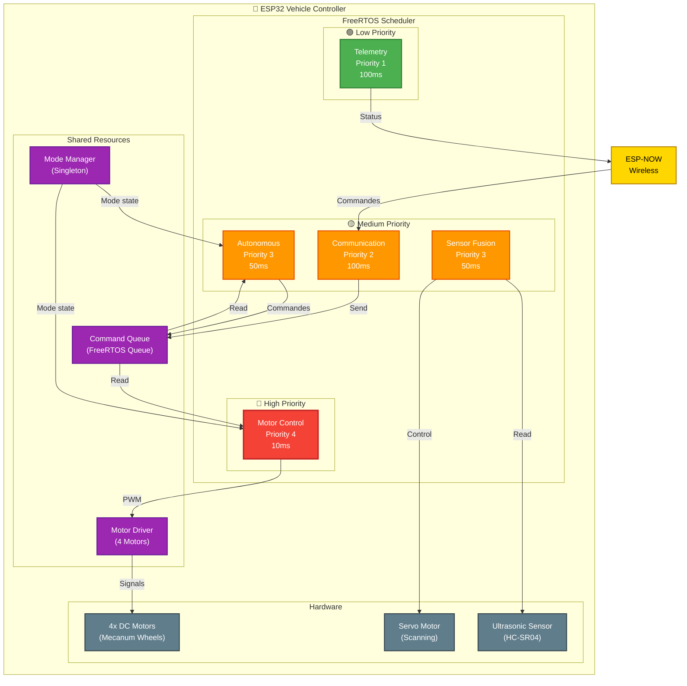
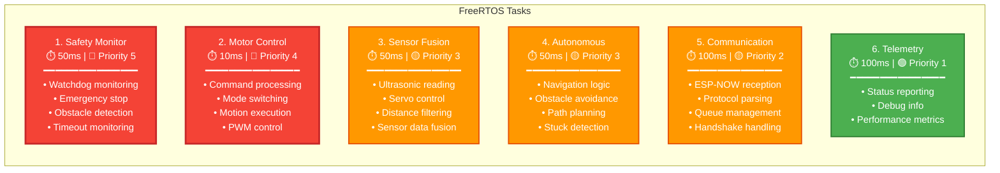
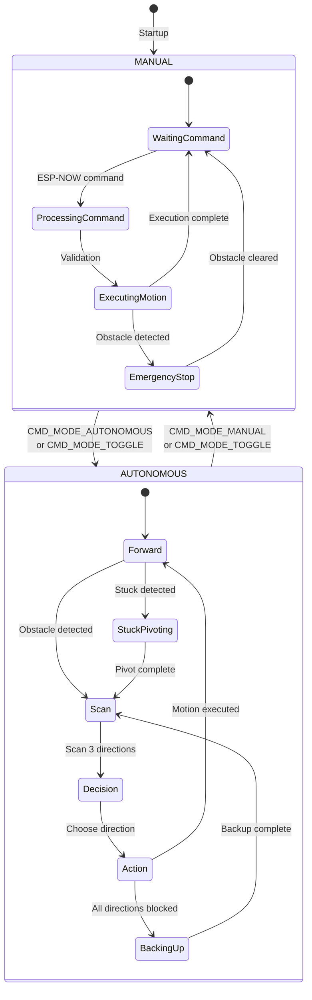
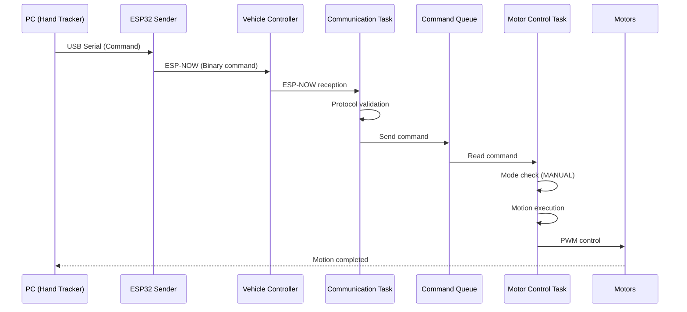
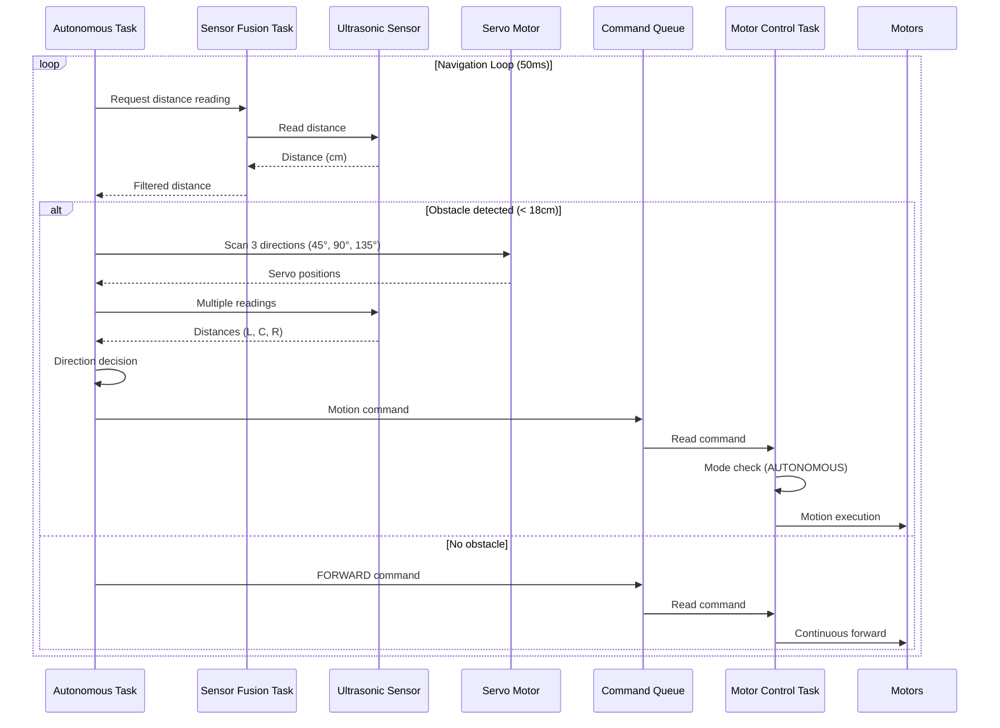
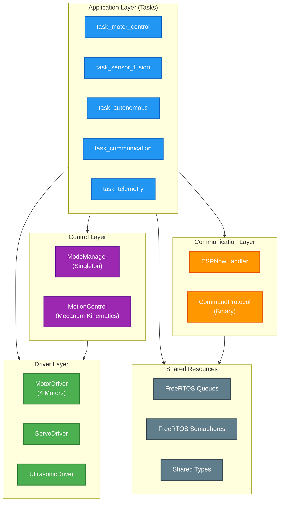

# 2. Architecture Car (ESP32 Controller)

## 2.1 Controller Overview

The car controller uses **FreeRTOS** to manage multiple concurrent tasks with different priorities. It supports **2 driving modes**: **MANUAL** and **AUTONOMOUS**.

## 2.2 Car Architecture Diagram - Global View

## 2.3 Task Architecture (Details)

## 2.4 Driving Modes

The system supports **2 driving modes** managed by the `ModeManager`:

### Mode MANUAL
- Control via hand gestures (PC → ESP32 Sender → Vehicle)
- Commands received via ESP-NOW
- Real-time responsiveness (< 20ms)

### Mode AUTONOMOUS
- Autonomous navigation with obstacle avoidance
- Uses ultrasonic sensor + servo for scanning
- Stuck detection
- Navigation algorithm with 3-direction scan

## 2.5 Mode Diagram

## 2.6 Data Flow - MANUAL Mode

## 2.7 Data Flow - AUTONOMOUS Mode

## 2.8 Software Layer Structure

---
