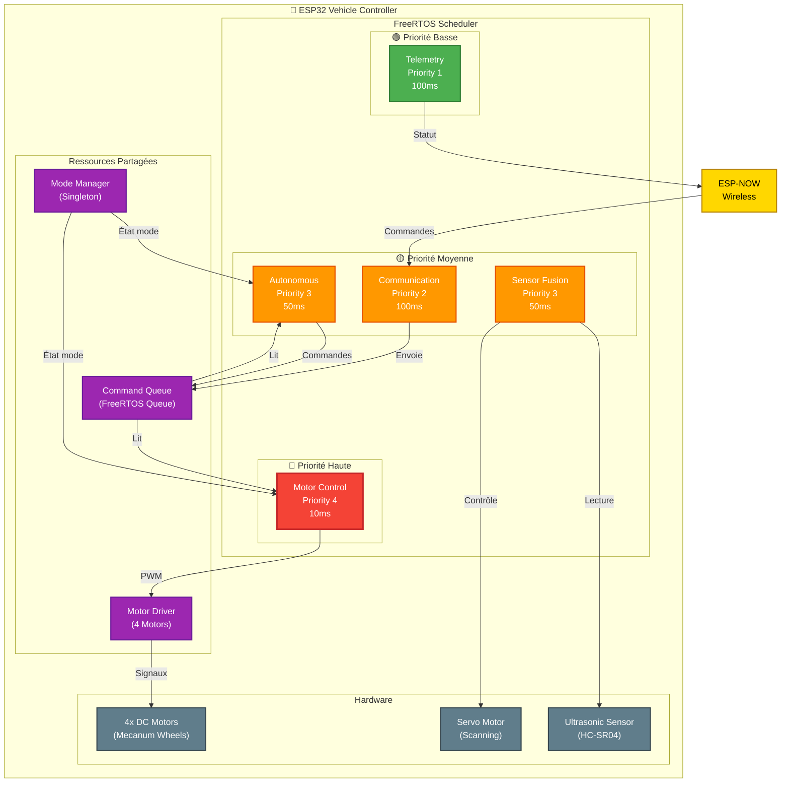
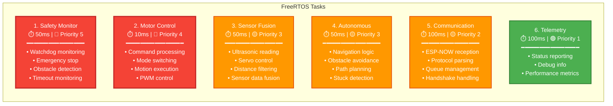
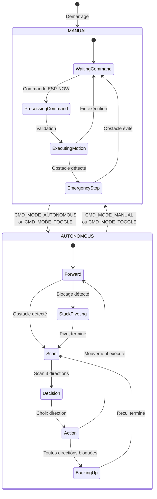
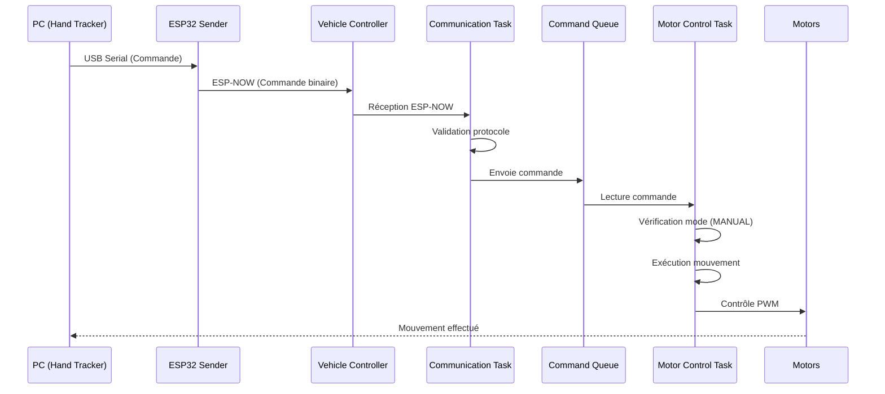
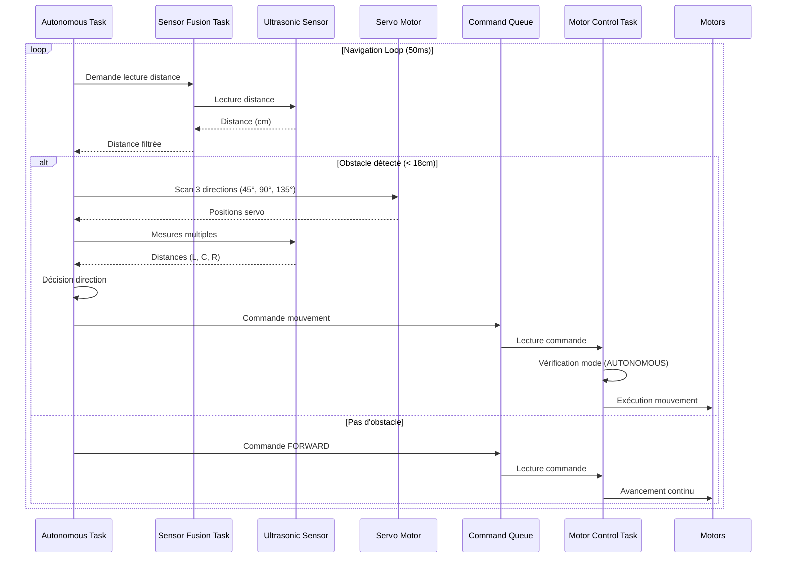
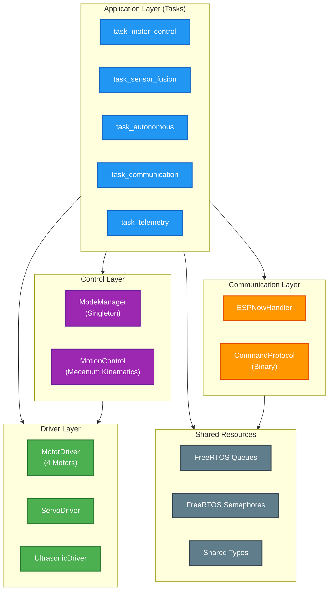

# 2. Architecture Véhicule (ESP32 Controller)

## 2.1 Vue d'Ensemble du Contrôleur

Le contrôleur véhicule utilise **FreeRTOS** pour gérer plusieurs tâches concurrentes avec des priorités différentes. Il supporte **2 modes de conduite** : **MANUAL** et **AUTONOMOUS**.

## 2.2 Schéma Architecture Véhicule - Vue Globale

## 2.3 Architecture des Tasks (Détails)

## 2.4 Modes de Conduite

Le système supporte **2 modes de conduite** gérés par le `ModeManager` :

### Mode MANUAL
- Contrôle via gestes de la main (PC → ESP32 Sender → Vehicle)
- Commandes reçues via ESP-NOW
- Réactivité temps réel (< 20ms)

### Mode AUTONOMOUS
- Navigation autonome avec évitement d'obstacles
- Utilise capteur ultrasonique + servo pour scanning
- Détection de blocage (stuck detection)
- Algorithme de navigation avec scan 3 directions

## 2.5 Schéma des Modes

## 2.6 Flux de Données - Mode MANUAL

## 2.7 Flux de Données - Mode AUTONOMOUS

## 2.8 Structure des Couches Logiciel

---
