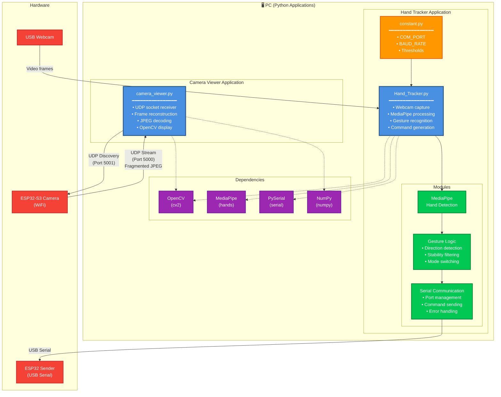
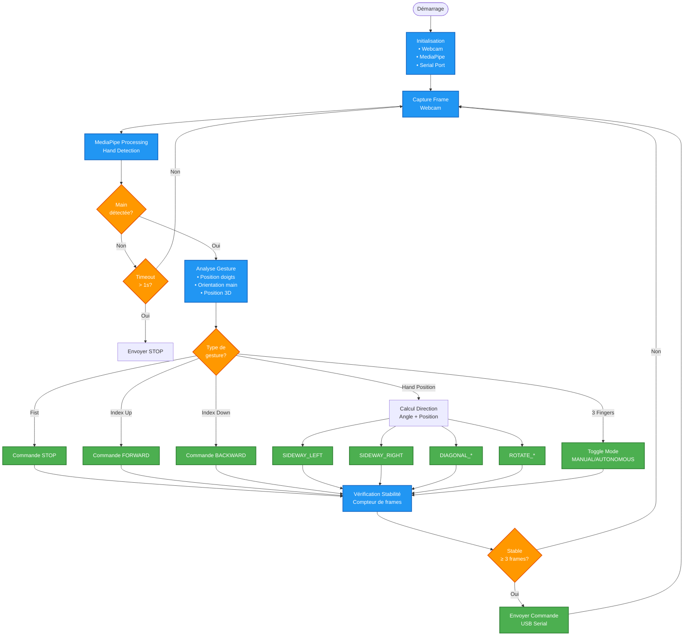
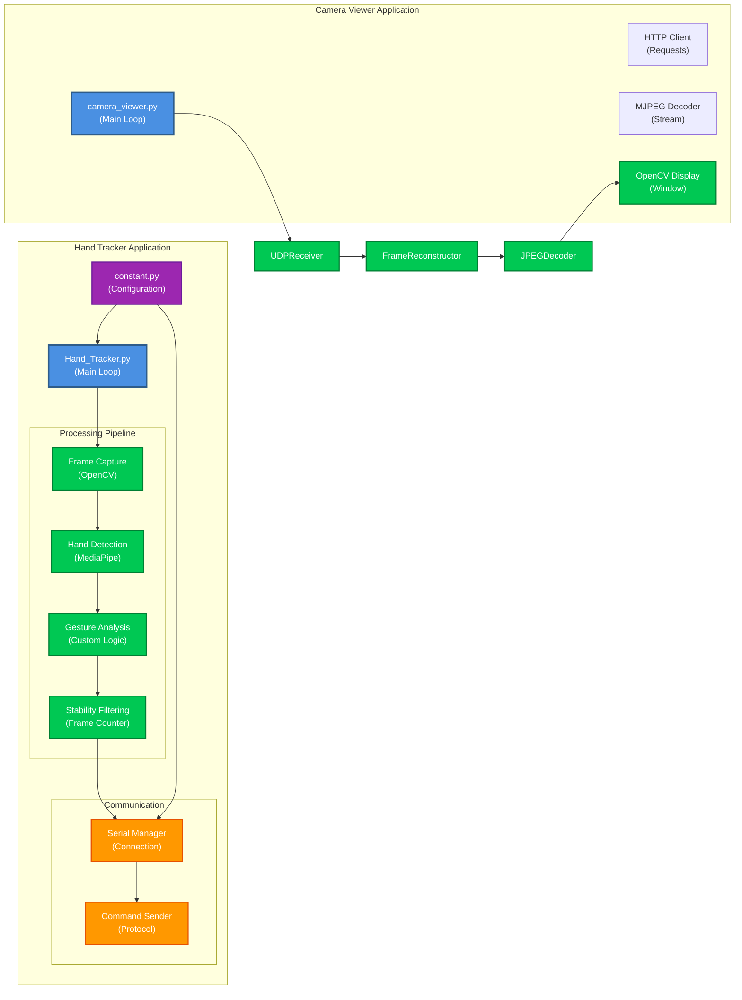

# 3. Architecture PC (Hand Tracking & Camera)

## 3.1 Vue d'Ensemble PC

Le côté PC est composé de **2 applications Python principales** qui fonctionnent indépendamment :

- **Hand Tracker** : Reconnaissance de gestes avec MediaPipe
- **Camera Viewer** : Visualisation du stream vidéo depuis ESP32-S3

## 3.2 Schéma Architecture PC

## 3.3 Flux de Traitement - Hand Tracker

## 3.4 Commandes Gestuelles

| Gesture | Commande | Code Hex | Description |
|---------|----------|----------|-------------|
| 👊 **Fist** | `STOP` | `0x00` | Arrêt complet |
| 👆 **Index Up** | `FORWARD` | `0x01` | Avancer |
| 👇 **Index Down** | `BACKWARD` | `0x02` | Reculer |
| ✋ **Hand Position** | `SIDEWAY_LEFT/RIGHT` | `0x03/0x04` | Déplacement latéral |
| 🔄 **Circle** | `ROTATE_CW/CCW` | `0x05/0x06` | Rotation |
| 📍 **Hand Position** | `DIAGONAL_*` | `0x07-0x0A` | Mouvements diagonaux |
| ✌️ **3 Fingers** | `MODE_TOGGLE` | `0x22` | Basculer mode |

## 3.5 Architecture des Modules PC

---
