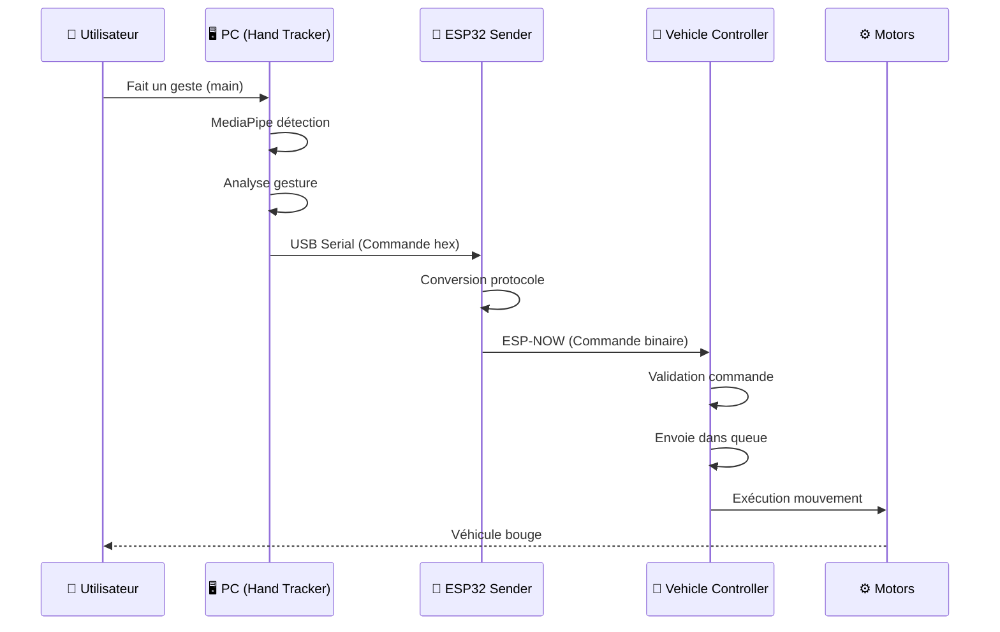
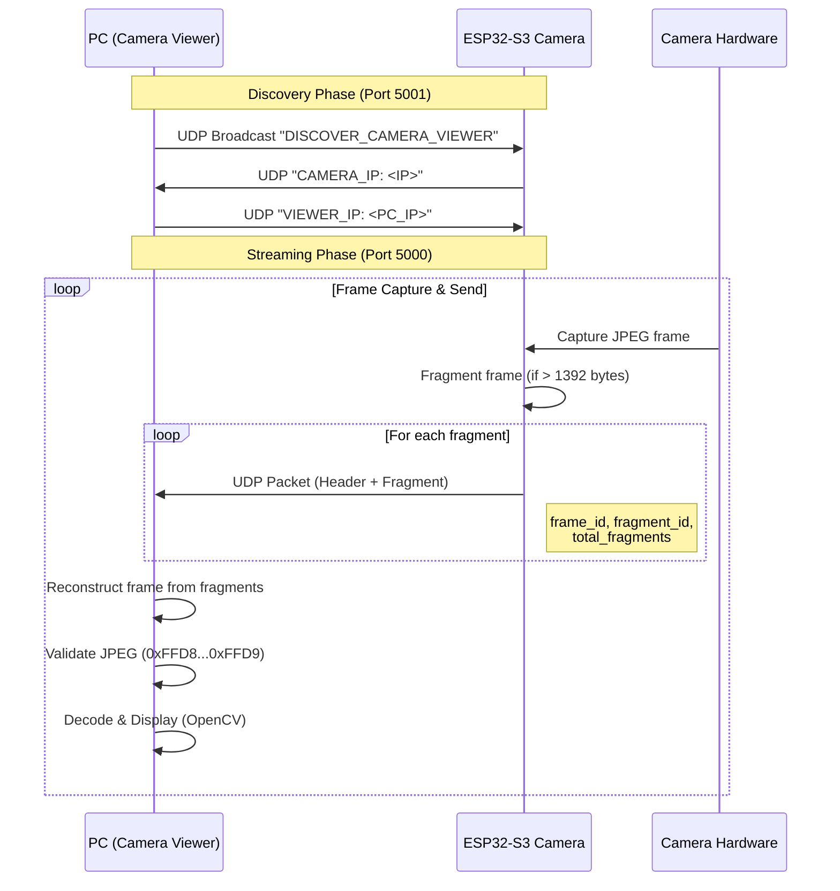
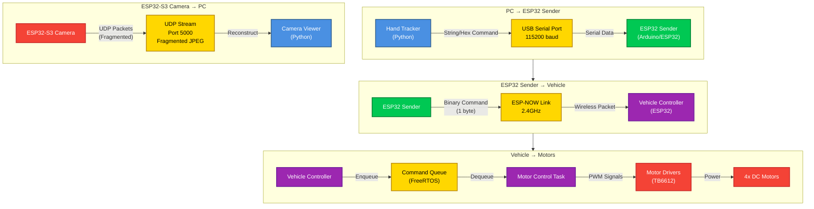

# 4. Flux de Communication

## 4.1 Protocole de Communication Global



## 4.2 Protocole de Commande Binaire

Le système utilise un **protocole binaire simple** avec des commandes d'un seul byte :

```
┌─────────────────────────────────────────┐
│  Format de Commande (1 byte)            │
├─────────────────────────────────────────┤
│  Byte 0: Code Commande (0x00 - 0xFF)   │
│                                          │
│  Commandes Mouvement:                   │
│  0x00: STOP                             │
│  0x01: FORWARD                           │
│  0x02: BACKWARD                          │
│  0x03: SIDEWAY_LEFT                      │
│  0x04: SIDEWAY_RIGHT                     │
│  0x05: ROTATE_CW                         │
│  0x06: ROTATE_CCW                        │
│  0x07-0x0A: DIAGONAL_*                   │
│  0x0B-0x0C: PIVOT_*                      │
│                                          │
│  Commandes Mode:                         │
│  0x20: MODE_MANUAL                       │
│  0x21: MODE_AUTONOMOUS                   │
│  0x22: MODE_TOGGLE                       │
│                                          │
│  Commandes Système:                      │
│  0xF0: HANDSHAKE_INIT                    │
│  0xF1: HANDSHAKE_ACK                     │
│  0xF2: HEARTBEAT                         │
└─────────────────────────────────────────┘
```

## 4.3 Protocole UDP Camera (ESP32-S3 → PC)

Le système de caméra utilise **UDP** pour le streaming vidéo avec fragmentation de frames JPEG :

### Format de Paquet UDP

```
┌─────────────────────────────────────────┐
│  Packet Header (8 bytes)                │
├─────────────────────────────────────────┤
│  frame_id:      uint32_t (4 bytes)      │
│  fragment_id:   uint16_t (2 bytes)      │
│  total_fragments: uint16_t (2 bytes)    │
├─────────────────────────────────────────┤
│  Fragment Data (max 1392 bytes)         │
│  JPEG frame data (fragmented)          │
└─────────────────────────────────────────┘
```

### Caractéristiques

- **Port UDP** : 5000 (stream), 5001 (discovery)
- **Taille max paquet** : 1400 bytes (UDP safe size)
- **Taille data par paquet** : 1392 bytes (1400 - 8 header)
- **Fragmentation** : Frames JPEG fragmentées si > 1392 bytes
- **Reconstruction** : PC reconstruit frames depuis fragments
- **Discovery** : Broadcast UDP sur port 5001 pour auto-découverte

### Flux UDP Camera



## 4.4 Schéma de Communication Détaillé



---
