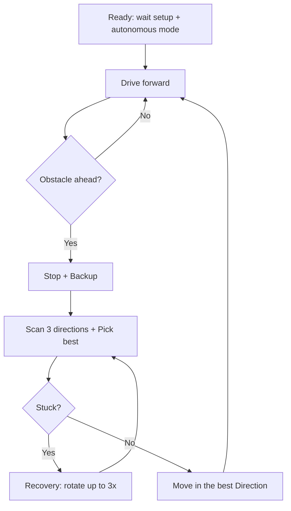

# Obstacle Detection Algorithm Flow

Simple flow and FSM for the autonomous obstacle avoidance in `task_autonomous.cpp`.

---

## 1. Algorithm flow (Mermaid)

## 3. FSM steps (written flow)

| Step | State / action | Condition / next |
|------|----------------|------------------|
| 1 | **WaitSetup** | Wait until `setupComplete` is true. |
| 2 | **CheckMode** | If not autonomous: wait 20 ms, go to CheckMode. If autonomous: go to DriveForward. |
| 3 | **DriveForward** | Send `CMD_FORWARD`, wait `forward_delay`. |
| 4 | **ReadSensor** | Read front distance from `SensorState`. If no state: loop. |
| 5 | **Obstacle?** | If front in (0, 20) cm → obstacle. Else → CheckMode. |
| 6 | **Stop** | Send `CMD_STOP`. |
| 7 | **Backup** | Send `CMD_BACKWARD`. For up to 800 ms, every 100 ms: read rear; if rear in (0, 15) cm set `rear_blocked` and break. |
| 8 | **StopBackup** | Send `CMD_STOP`. |
| 9 | **Scan** | Servo to 10°, 90°, 180°. For each angle: wait, take 20 samples, average valid (0–400 cm). Return distances [right, center, left]. |
| 10 | **PickBest** | Choose index with longest valid distance (0=right, 1=center, 2=left). Get `best_dir` and `max_distance`. |
| 11 | **StuckCheck** | If `max_distance <= 40` cm → Recovery. Else → ExecuteTurn. |
| 12 | **Recovery** | Up to 3 attempts: choose motion from best of 3 directions (0→CW, 2→CCW, 1→forward, else keep last rotate). Send motion 800 ms, stop, rescan, re-pick best. If still `max_distance <= 40` after 3 attempts: `CMD_STOP`, go to CheckMode. |
| 13 | **ExecuteTurn** | If `best_dir == 0`: `CMD_ROTATE_CW` 1200 ms then stop. If `best_dir == 2`: `CMD_ROTATE_CCW` 1200 ms then stop. If `best_dir == 1`: do nothing (next loop will drive forward). |
| 14 | **Loop** | After ExecuteTurn or after Recovery give-up → CheckMode (main loop). |

---

## 4. Main constants (from code)

| Constant | Value | Meaning |
|----------|--------|---------|
| Obstacle front | &lt; 20 cm | Trigger stop and backup. |
| Rear blocked | &lt; 15 cm | Stop backup. |
| Backup total | 800 ms | Max backup duration. |
| Stuck threshold | ≤ 40 cm | Enter recovery. |
| Recovery attempts | 3 | Max rotate/forward retries. |
| Turn window | 1200 ms | Duration of CW/CCW turn. |
| Rotate recovery | 800 ms | Duration of recovery rotate/forward. |
| Scan angles | 10°, 90°, 180° | Right, center, left (indices 0, 1, 2). |
