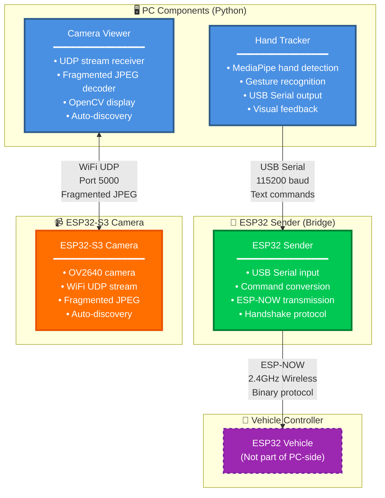
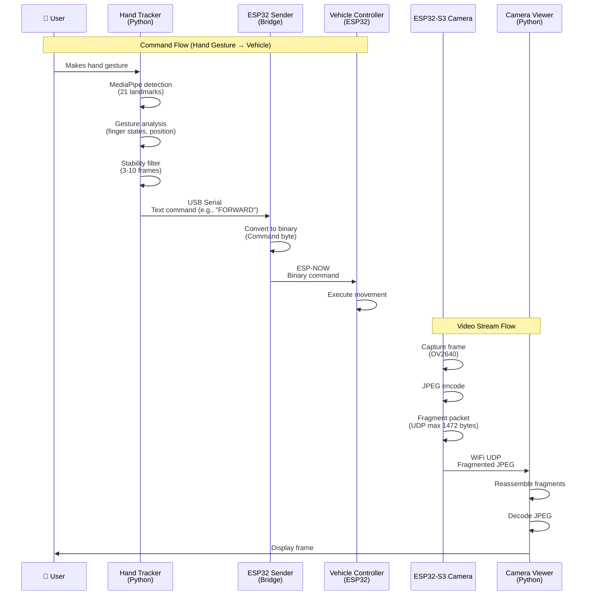

# PC-Side Components

The PC-side of the gesture-controlled car system handles hand gesture recognition, camera streaming, and wireless command transmission. All components run on your computer and communicate with ESP32 devices via USB Serial and WiFi.

## 🚀 Quick Start

```bash
# From project root, install dependencies
pip install -r requirements.txt

# Launch both components (hand tracking + camera stream)
./launch.sh
```

Or run components individually:

```bash
# Terminal 1: Hand tracking
cd Hand_Tracking && python Hand_Tracker.py

# Terminal 2: Camera stream viewer
cd ESP_Camera_Module/src && python camera_viewer.py
```

## 📋 Key Features

- **👋 Hand Gesture Recognition**: Real-time hand tracking using MediaPipe with 12+ gesture types
- **📹 Live Video Streaming**: View vehicle camera feed via WiFi UDP stream
- **📡 Wireless Command Bridge**: ESP32 sender bridges USB Serial to ESP-NOW protocol
- **⚡ Low Latency**: < 20ms command transmission from gesture to vehicle
- **🔄 Stability Filtering**: Prevents command jitter with frame-based confirmation

## 🏗️ PC-Side Architecture

### System Overview



### Component Interaction Flow



## 📦 Components

### 1. Hand Tracking (`Hand_Tracking/`)

**Purpose**: Detects hand gestures using MediaPipe and sends commands to the vehicle.

**Key Features**:
- Real-time hand landmark detection (21 points)
- 12+ gesture types (forward, backward, strafe, rotate, diagonal, etc.)
- Stability filtering to prevent command jitter
- Visual feedback with hand skeleton overlay
- Mode toggle (manual/autonomous) with 3-finger gesture

**Technology**: Python, MediaPipe, OpenCV, PySerial

**Quick Setup**:
```bash
cd Hand_Tracking
python Hand_Tracker.py
```

**Documentation**: See [Hand Tracking README](Hand_Tracking/README.md) for detailed information.

### 2. Camera Module (`ESP_Camera_Module/`)

**Purpose**: Receives and displays live video stream from ESP32-S3 camera module.

**Key Features**:
- Auto-discovery via UDP broadcast (port 5001)
- Fragmented JPEG reassembly
- Real-time video display using OpenCV
- Frame statistics and error handling
- Low-latency streaming

**Technology**: Python, OpenCV, UDP sockets

**Quick Setup**:
```bash
cd ESP_Camera_Module/src
python camera_viewer.py
```

**Documentation**: See [Camera Module README](ESP_Camera_Module/README.md) for detailed information.

### 3. ESP32 Sender (`Sender_Code/`)

**Purpose**: Wireless bridge that converts USB Serial commands to ESP-NOW protocol.

**Key Features**:
- Receives text commands from PC via USB Serial
- Converts text to binary command bytes
- Transmits via ESP-NOW to vehicle controller
- Handshake protocol for reliable connection
- Automatic retry on failure


## 🔄 Data Flow

### Command Flow (Hand Gesture → Vehicle)


### Video Stream Flow (Camera → Viewer)


## 🔗 Related Documentation

- **[Main Project README](../README.md)** - Complete system overview
- **[Vehicle Controller](../Vehicule/README.md)** - ESP32 vehicle control system
- **[Architecture Documentation](../docs/architecture.md)** - System architecture details
- **[PC Side Components Technical Details](../docs/PC_SIDE_COMPONENTS.md)** - Technical reference

## 💡 Tips for Junior Developers

### Understanding the System

1. **Hand Tracker**: Think of it as a translator - it watches your hand and translates gestures into commands
2. **ESP32 Sender**: Acts like a wireless bridge - takes commands from your PC and sends them wirelessly to the vehicle
3. **Camera Viewer**: Like a video call - receives video packets from the vehicle and displays them on your screen

### Common Concepts

- **USB Serial**: A way for your PC to talk to ESP32 devices via USB cable (like a chat window)
- **ESP-NOW**: A fast wireless protocol for ESP32 devices to communicate (like Bluetooth but faster)
- **UDP**: A network protocol for sending data packets (like sending postcards - fast but no guarantee of delivery)
- **Fragmented JPEG**: Large images split into smaller pieces for transmission (like sending a large file in chunks)

### Debugging Tips

1. **Always check Serial Monitor first** - it shows what's happening on ESP32 devices
2. **Start with one component** - test hand tracker alone, then camera, then combine
3. **Check connections** - USB cables, WiFi network, power supplies
4. **Use print statements** - Add debug prints in Python code to see what's happening

---

**Happy Coding! 🚗👋**
